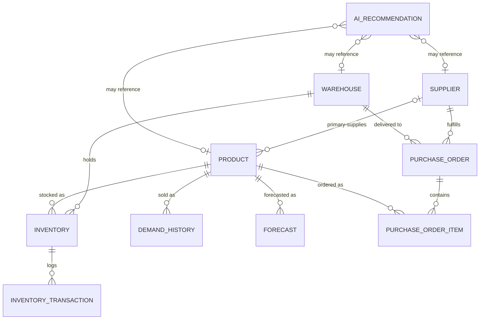

# OpsPilot AI — Data Dictionary

**Status:** Current as of Milestone 1.3 (synthetic dataset seeded)
**Last updated:** 2026-08-02
**Source of truth:** [prisma/schema.prisma](prisma/schema.prisma) — if this document and the schema ever disagree, the schema wins. Regenerate/update this file when the schema changes.
**Related:** [SYSTEM_ARCHITECTURE.md](SYSTEM_ARCHITECTURE.md) · [PRODUCT_REQUIREMENTS_DOCUMENT.md](PRODUCT_REQUIREMENTS_DOCUMENT.md) · [prisma/seed.ts](prisma/seed.ts)

---

## 1. Overview

This document describes every table, enum, relationship, and business rule in the OpsPilot AI database. It's written for a developer joining the project who needs to understand *what the data means*, not just its column names — the schema file tells you the shape; this document tells you the intent.

**Scope reminder** (see [PROJECT_PLAN.md](PROJECT_PLAN.md)): this is a single-company academic demo database for one fictional FMCG company, **NovaFoods Pvt. Ltd.** There is no multi-tenancy, no user/auth tables, and no billing — every row in every table belongs to the same company.

**Database engine:** SQLite (file: `prisma/dev.db`), accessed exclusively through Prisma Client. All application code should go through Prisma — nothing in this project talks to SQLite directly except ad hoc inspection.

---

## 2. Conventions

### 2.1 Primary keys
Every table uses `id String @id @default(uuid())` — a client-generated UUID v4 string, not an autoincrement integer. Prisma generates the UUID before the row is written, which is why the seed script can build the entire in-memory dataset (with all foreign keys wired up) before touching the database at all.

### 2.2 Timestamps
Most tables have `createdAt DateTime @default(now())`. Tables representing mutable entities (`Warehouse`, `Product`, `Inventory`, `Supplier`, `PurchaseOrder`, `AIRecommendation`) also have `updatedAt DateTime @updatedAt`, which Prisma sets automatically on every write. Tables representing immutable log/history rows (`InventoryTransaction`, `PurchaseOrderItem`, `DemandHistory`, `Forecast`) intentionally have **no** `updatedAt` — they are written once and never modified.

Internally, SQLite has no native `DATETIME` type; Prisma stores every `DateTime` field as an integer (Unix epoch milliseconds). Prisma Client converts this to/from a JS `Date` transparently — you will never see the raw integer unless you query the `.db` file directly with `sqlite3`.

### 2.3 Enums are not database-enforced (important)
SQLite has no native enum type. Every `enum` field in `schema.prisma` is stored as a plain `TEXT` column with **no `CHECK` constraint** — confirmed by inspecting the actual migration SQL. Enum validity (e.g., a `Product.category` value being one of the 7 defined categories) is enforced **only by Prisma Client / TypeScript at the application layer**. If a row were ever inserted via raw SQL rather than through Prisma, the database would silently accept an invalid string. In practice this is a non-issue as long as all writes go through Prisma — but it's a real property of this database you should know about, not an oversight.

### 2.4 Business rule vs. database constraint
Some rules in this document are enforced by the database (foreign keys, unique indexes, `NOT NULL`) — these are marked **Constraint**. Others are conventions the application layer is expected to maintain but SQLite cannot enforce (e.g., "on-hand quantity should equal the sum of its transactions") — these are marked **Business Rule** and are trust-based, not guaranteed by the schema.

---

## 3. Entity-Relationship Diagram

Read this as: a `Warehouse` and a `Product` combine (through `Inventory`, the resolver table) to form the true many-to-many "which products are stocked where." Everything else hangs off `Product`, `Supplier`, and `Warehouse` as the three core reference entities.

---

## 4. Enumerations

All enum values are stored as their literal string (e.g., `"CRITICAL"`), not as integers.

### `ProductCategory`
Which of NovaFoods' 7 product lines a SKU belongs to.

| Value | Meaning |
|---|---|
| `DAIRY` | Milk, curd, paneer, cheese, ghee, etc. (perishable) |
| `BEVERAGES` | Cold drinks, water, juices, tea, coffee (split internally into "cold" and "hot" sub-patterns in the seed generator — not a stored field, see §10) |
| `SNACKS` | Salty snacks and chocolates/confectionery |
| `BAKERY` | Bread, biscuits, cakes (perishable) |
| `PERSONAL_CARE` | Shampoo, soap, toothpaste, etc. |
| `HOUSEHOLD` | Cleaning products, paper goods, etc. |
| `FROZEN_FOODS` | Frozen vegetables, ready-to-eat, ice cream (perishable) |

### `ABCClass`
Pareto/ABC inventory classification by revenue or usage contribution (standard OM concept — see [PRODUCT_REQUIREMENTS_DOCUMENT.md §5](PRODUCT_REQUIREMENTS_DOCUMENT.md)).

| Value | Meaning |
|---|---|
| `A` | Top ~80% of cumulative usage value — highest priority |
| `B` | Next ~15% |
| `C` | Remaining ~5% — lowest priority |

**Not yet populated:** every `Product.abcClass` is currently `NULL`. The classification algorithm is deliberately deferred to a later milestone (the OM calculation engine) — see §9.

### `StockStatus`
The health of a product's stock position **at one specific warehouse** (this is an `Inventory`-level field, not a `Product`-level field — the same product can be `HEALTHY` at one warehouse and `CRITICAL` at another).

| Value | Meaning |
|---|---|
| `HEALTHY` | On-hand comfortably above the reorder point |
| `LOW` | Approaching the reorder point — replenishment should be scheduled soon |
| `CRITICAL` | At or below the reorder point — stockout risk |
| `OVERSTOCKED` | Far above the reorder point — excess capital tied up in stock |

### `PurchaseOrderStatus`
Lifecycle of a purchase order.

| Value | Meaning |
|---|---|
| `DRAFT` | Created, not yet submitted |
| `SUBMITTED` | Sent, awaiting approval |
| `APPROVED` | Approved, awaiting shipment |
| `IN_TRANSIT` | Shipped, not yet received |
| `RECEIVED` | Goods physically arrived (only status that generates an `InventoryTransaction`) |
| `CANCELLED` | Order will not be fulfilled |

### `ForecastMethod`
Which statistical method produced a given `Forecast` row.

| Value | Meaning |
|---|---|
| `MOVING_AVERAGE` | Simple average of the trailing N periods (N=4 weeks in the seed data) |
| `EXPONENTIAL_SMOOTHING` | Weighted smoothing favoring recent periods (α=0.3 in the seed data) |

### `RecommendationCategory`
Which module/domain an `AIRecommendation` relates to.

| Value | Meaning |
|---|---|
| `INVENTORY` | Stock level / reorder / warehouse capacity issues |
| `PROCUREMENT` | Purchase order issues (e.g., overdue delivery) |
| `SUPPLIER` | Supplier reliability/performance issues |
| `DEMAND` | Forecasted demand changes (e.g., seasonal upcoming spike) |

### `RecommendationSeverity`
| Value | Meaning |
|---|---|
| `CRITICAL` | Needs action now |
| `WARNING` | Needs attention soon |
| `INFO` | Informational, no immediate action required |

### `RecommendationStatus`
| Value | Meaning |
|---|---|
| `ACTIVE` | Still open, awaiting a decision |
| `ACCEPTED` | User acted on it |
| `DISMISSED` | User explicitly dismissed it |
| `SNOOZED` | Deferred for later review |

### `TransactionType`
The kind of stock movement an `InventoryTransaction` records. See the **Business Rules** note in §7 on sign convention.

| Value | Meaning | Sign convention |
|---|---|---|
| `PURCHASE` | Goods received against a purchase order | positive |
| `SALE` | Stock sold/consumed | negative |
| `TRANSFER_IN` | Stock arriving from another warehouse | positive |
| `TRANSFER_OUT` | Stock leaving to another warehouse | negative |
| `RETURN` | Customer/channel return added back to stock | positive |
| `ADJUSTMENT` | Manual correction (e.g., cycle count) | either sign |

---

## 5. Tables

### 5.1 `Warehouse`

**Purpose:** The physical distribution centers NovaFoods operates out of.

**Business description:** NovaFoods runs exactly 4 warehouses across India (Delhi, Mumbai, Bengaluru, Kolkata), each with a different capacity and a different utilization character — from Mumbai running near-full to Kolkata sitting on excess space. Every stock position (`Inventory`) and every purchase order delivery is scoped to one warehouse.

| Field | Type | Nullable | Default | Description | Example |
|---|---|---|---|---|---|
| `id` | String (UUID) | No | generated | Primary key | `3a36af16-080b-43d9-9c29-bb95b8134bdc` |
| `name` | String | No | — | Display name | `"NovaFoods Delhi Distribution Center"` |
| `location` | String | No | — | City/country, free text | `"Delhi, India"` |
| `capacityUnits` | Float | No | — | Total storage capacity, in the same "units" as `Inventory.onHandQty` (see §9 — this is a simplification, not a real volumetric unit) | `224447.0` |
| `createdAt` | DateTime | No | `now()` | Row creation time | `2026-08-01` |
| `updatedAt` | DateTime | No | auto | Last modification time | `2026-08-01` |

**Relationships:**
- `inventory` — one-to-many → `Inventory` (this warehouse's stock positions)
- `purchaseOrders` — one-to-many → `PurchaseOrder` (orders being delivered here)
- `recommendations` — one-to-many → `AIRecommendation` (optional; recommendations about this warehouse)

**Constraints:** none beyond `NOT NULL` on `name`/`location`/`capacityUnits`. No unique constraint on `name` — nothing currently prevents two warehouses with the same name (not a concern at 4 rows, but worth knowing).

**Indexes:** none beyond the implicit primary key index. (At only 4 rows, no query pattern needed one.)

**Used by modules:** Inventory Intelligence (per-warehouse stock views), Procurement (delivery destination), Analytics (utilization %, computed as `SUM(Inventory.onHandQty) / capacityUnits` — **not stored**, see §6), Executive Dashboard (capacity alerts), Operations Copilot.

---

### 5.2 `Product`

**Purpose:** The SKU catalog — every item NovaFoods stocks and sells.

**Business description:** The central reference entity. 203 products across 7 categories, each with a unique SKU code, a cost/price, a lead time, a perishability flag, and an optional "primary supplier." Everything else (stock, demand, forecasts, order lines, recommendations) hangs off a product.

| Field | Type | Nullable | Default | Description | Example |
|---|---|---|---|---|---|
| `id` | String (UUID) | No | generated | Primary key | `35e87cf0-d1cb-409a-a7bf-73ed7abbd1c0` |
| `sku` | String | No | — | Unique product code | `"DAI-0001"` |
| `name` | String | No | — | Display name | `"NovaFresh Toned Milk 500ml"` |
| `category` | `ProductCategory` | No | — | See §4 | `"DAIRY"` |
| `unitOfMeasure` | String | No | — | Unit the product is sold/measured in | `"ml"`, `"g"`, `"kg"`, `"l"`, `"pc"` |
| `unitCost` | Float | No | — | What NovaFoods pays per unit (₹) | `15.0` |
| `unitPrice` | Float | No | — | What NovaFoods sells for per unit (₹) | `18.83` |
| `leadTimeDays` | Int | No | — | Replenishment lead time — inherited from the primary supplier's `contractedLeadTimeDays` at creation time | `4` |
| `perishable` | Boolean | No | `false` | Whether the product has a short shelf life | `true` |
| `abcClass` | `ABCClass?` | Yes | `null` | See §4 — currently unpopulated for all rows | `null` |
| `primarySupplierId` | String? (FK) | Yes | `null` | See relationships below | `f13243e5-...` |
| `createdAt` / `updatedAt` | DateTime | No | auto | — | — |

**Relationships:**
- `primarySupplier` — **many-to-one**, optional → `Supplier`. `onDelete: SetNull` — deleting a supplier does not delete its products, just clears the pointer. This is a deliberate simplification: a product has exactly one "preferred" supplier, not a true many-to-many sourcing network. See §10.
- `inventory` — one-to-many → `Inventory`
- `purchaseOrderItems` — one-to-many → `PurchaseOrderItem`
- `demandHistory` — one-to-many → `DemandHistory`
- `forecasts` — one-to-many → `Forecast`
- `recommendations` — one-to-many → `AIRecommendation` (optional)

**Constraints:**
- `sku` — **unique** (Constraint)
- `primarySupplierId` FK → `Supplier.id`, `ON DELETE SET NULL`

**Indexes:** `@@index([category])` (category filtering in the catalog view), `@@index([primarySupplierId])` (supplier → products lookups).

**Used by modules:** Inventory Intelligence (catalog, detail view), Procurement (EOQ/order creation), Suppliers (which SKUs a supplier provides), Demand Forecasting, Analytics (ABC analysis — future), Operations Copilot.

---

### 5.3 `Inventory`

**Purpose:** The current stock position of one product at one warehouse — the resolver table for the `Product` ↔ `Warehouse` many-to-many relationship.

**Business description:** This is where "how much of X do we have at warehouse Y" lives, along with the calculated safety stock and reorder point that drive replenishment decisions. A product with 4 warehouses has (up to) 4 `Inventory` rows, and each can independently be Healthy, Low, Critical, or Overstocked.

| Field | Type | Nullable | Default | Description | Example |
|---|---|---|---|---|---|
| `id` | String (UUID) | No | generated | Primary key | `33318b35-2249-...` |
| `onHandQty` | Float | No | — | Current physical stock | `397.0` |
| `safetyStock` | Float | No | `0` | **Calculated** — buffer stock for demand variability during lead time (§6) | `43.0` |
| `reorderPoint` | Float | No | `0` | **Calculated** — on-hand level that should trigger a reorder (§6) | `1134.0` |
| `stockStatus` | `StockStatus` | No | `HEALTHY` | **Calculated** classification — see §4 | `"CRITICAL"` |
| `lastCalculatedAt` | DateTime? | Yes | `null` | When `safetyStock`/`reorderPoint`/`stockStatus` were last (re)computed | `2026-07-26` |
| `productId` | String (FK) | No | — | → `Product.id` | — |
| `warehouseId` | String (FK) | No | — | → `Warehouse.id` | — |
| `createdAt` / `updatedAt` | DateTime | No | auto | — | — |

**Relationships:**
- `product` — many-to-one → `Product`, `ON DELETE CASCADE` (an inventory row is meaningless without its product)
- `warehouse` — many-to-one → `Warehouse`, `ON DELETE CASCADE`
- `transactions` — one-to-many → `InventoryTransaction`

**Constraints:**
- **`@@unique([productId, warehouseId])`** — at most one stock row per product per warehouse (Constraint)
- Both FKs `ON DELETE CASCADE`

**Indexes:** `@@index([warehouseId])` (per-warehouse stock views), `@@index([stockStatus])` (filtering by health, e.g. "show me all Critical items").

**Used by modules:** Inventory Intelligence (core table), Executive Dashboard (at-risk SKU counts, KPI tiles), Analytics (turnover, warehouse utilization), Operations Copilot (recommendation generation input).

---

### 5.4 `InventoryTransaction`

**Purpose:** An immutable audit log of stock movements against a specific `Inventory` row.

**Business description:** Every time stock moves — a purchase receipt, a sale, a transfer, a manual correction — it should be logged here. This is what makes stock changes explainable after the fact ("why is this Critical?") rather than just a mystery snapshot. Added in Milestone 1.2 specifically to support a real audit trail and future inventory analytics (velocity, turnover).

| Field | Type | Nullable | Default | Description | Example |
|---|---|---|---|---|---|
| `id` | String (UUID) | No | generated | Primary key | `d8b3dcd8-...` |
| `transactionType` | `TransactionType` | No | — | See §4 | `"PURCHASE"` |
| `quantity` | Float | No | — | **Signed** — see Business Rules §7 | `2458.0` (a purchase) or `-62.0` (a sale) |
| `reference` | String? | Yes | `null` | Free-text reference, e.g. a PO number | `"PO-00001"` |
| `notes` | String? | Yes | `null` | Free-text note | `null`, or `"Week 3/8 of a demand-outpacing-replenishment decline..."` |
| `inventoryId` | String (FK) | No | — | → `Inventory.id` | — |
| `createdAt` | DateTime | No | `now()` (or explicitly backdated by the seed script to the real event date) | When the movement happened | `2026-06-08` |

**Relationships:**
- `inventory` — many-to-one → `Inventory`, **`ON DELETE RESTRICT`** — deliberately different from every other tightly-owned child table in this schema (which cascade). An audit log that disappears when its subject is deleted isn't an audit log. Practical effect: you cannot delete an `Inventory` row (and therefore, transitively, cannot delete a `Product` or `Warehouse`) that has any transaction history.

**Constraints:** `inventoryId` FK, `ON DELETE RESTRICT`. No uniqueness constraint — many transactions can exist for one inventory row (that's the point).

**Indexes:** `@@index([inventoryId])` (fetch a stock item's full history), `@@index([transactionType])` (filter by movement type).

**Used by modules:** Inventory Intelligence (stock trend chart, audit trail), Analytics (future: turnover/velocity metrics).

**No table currently:** `SALE`-type entries are only seeded for the 3 "Healthy → Low → Critical" demo products — the catalog-wide sales ledger is deliberately not synthesized (would be 100k+ rows); `DemandHistory` stands in for aggregate demand elsewhere. See §10.

---

### 5.5 `Supplier`

**Purpose:** NovaFoods' vendor directory.

**Business description:** 20 suppliers, each specializing in one or more product categories, each with a lead time, payment terms, and a reliability score that drives procurement decisions and the Operations Copilot's supplier-risk recommendations.

| Field | Type | Nullable | Default | Description | Example |
|---|---|---|---|---|---|
| `id` | String (UUID) | No | generated | Primary key | `f13243e5-...` |
| `name` | String | No | — | Company name | `"Amrit Agro Foods Pvt. Ltd."` |
| `contactEmail` | String? | Yes | `null` | — | `"procurement@amritagrofoods.in"` |
| `contactPhone` | String? | Yes | `null` | — | `"+91-9800000000"` |
| `contractedLeadTimeDays` | Int | No | — | Standard lead time this supplier commits to | `4` |
| `paymentTerms` | String? | Yes | `null` | Free text | `"Net 30"` |
| `reliabilityScore` | Float? | Yes | `null` | **Calculated** (currently hand-set "current value" in seed data — see §6/§9) — 0–100 composite score | `94.0` |
| `createdAt` / `updatedAt` | DateTime | No | auto | — | — |

**Relationships:**
- `products` — one-to-many → `Product` (products naming this supplier as primary)
- `purchaseOrders` — one-to-many → `PurchaseOrder`
- `recommendations` — one-to-many → `AIRecommendation` (optional)

**Constraints:** none beyond `NOT NULL` on required fields. No unique constraint on `name`.

**Indexes:** none beyond the primary key (20 rows — no query pattern needs one yet).

**Used by modules:** Suppliers (scorecards, core table), Procurement (supplier selection for POs), Operations Copilot (reliability-decline recommendations).

---

### 5.6 `PurchaseOrder`

**Purpose:** An order placed with one supplier, for delivery to one warehouse.

**Business description:** The core procurement transaction. Tracks the full lifecycle from Draft through Received (or Cancelled), and the gap between `expectedDeliveryDate` and `actualDeliveryDate` is exactly what feeds supplier reliability scoring.

| Field | Type | Nullable | Default | Description | Example |
|---|---|---|---|---|---|
| `id` | String (UUID) | No | generated | Primary key | `b4e769f5-...` |
| `status` | `PurchaseOrderStatus` | No | `DRAFT` | See §4 | `"RECEIVED"` |
| `orderDate` | DateTime | No | `now()` | When the order was placed | `2026-06-06` |
| `expectedDeliveryDate` | DateTime? | Yes | `null` | Promised delivery date (`orderDate` + supplier's lead time) | `2026-06-10` |
| `actualDeliveryDate` | DateTime? | Yes | `null` | When goods actually arrived — only set once `RECEIVED` | `2026-06-08` |
| `supplierId` | String (FK) | No | — | → `Supplier.id` | — |
| `warehouseId` | String (FK) | No | — | → `Warehouse.id` | — |
| `createdAt` / `updatedAt` | DateTime | No | auto | — | — |

**Relationships:**
- `supplier` — many-to-one → `Supplier`, **`ON DELETE RESTRICT`** (protects order history — you cannot delete a supplier with existing POs)
- `warehouse` — many-to-one → `Warehouse`, **`ON DELETE RESTRICT`**
- `items` — one-to-many → `PurchaseOrderItem`

**Constraints:** both FKs `ON DELETE RESTRICT`.

**Indexes:** `@@index([supplierId])`, `@@index([warehouseId])`, `@@index([status])` (all three are common filter dimensions in the Procurement module).

**Used by modules:** Procurement (core table), Suppliers (delivery history feeding reliability), Executive Dashboard (open PO value KPI), Operations Copilot (overdue-order recommendations).

---

### 5.7 `PurchaseOrderItem`

**Purpose:** A single product line within a purchase order.

**Business description:** Normalizes the fact that one PO typically covers multiple products. Deliberately does **not** store a `subtotal` column — that's `quantity × unitCost`, computed on read rather than duplicated (avoids a stale-data bug class).

| Field | Type | Nullable | Default | Description | Example |
|---|---|---|---|---|---|
| `id` | String (UUID) | No | generated | Primary key | `e2a8a684-...` |
| `quantity` | Float | No | — | Units ordered | `2458.0` |
| `unitCost` | Float | No | — | Cost per unit **at the time this PO was placed** (may differ slightly from `Product.unitCost`, which is the current catalog cost) | `14.44` |
| `purchaseOrderId` | String (FK) | No | — | → `PurchaseOrder.id` | — |
| `productId` | String (FK) | No | — | → `Product.id` | — |
| `createdAt` | DateTime | No | `now()` | — | — |

**Relationships:**
- `purchaseOrder` — many-to-one → `PurchaseOrder`, `ON DELETE CASCADE` (a line item is meaningless without its parent order)
- `product` — many-to-one → `Product`, **`ON DELETE RESTRICT`** (protects order history — cannot delete a product that appears in any PO)

**Constraints:** both FKs; `purchaseOrderId` cascades, `productId` restricts.

**Indexes:** `@@index([purchaseOrderId])`, `@@index([productId])`.

**Used by modules:** Procurement (PO detail/creation), Analytics (spend analysis).

---

### 5.8 `DemandHistory`

**Purpose:** Historical (actual) demand/sales, one row per product per time period.

**Business description:** The ground truth the forecasting engine trains against. Currently seeded at **weekly** granularity (not daily) — see §9 for why. 78 weeks (~18 months) per product.

| Field | Type | Nullable | Default | Description | Example |
|---|---|---|---|---|---|
| `id` | String (UUID) | No | generated | Primary key | `d3841c84-...` |
| `periodDate` | DateTime | No | — | Start of the period this row covers (a Monday, in the current weekly-granularity data) | `2025-02-03` |
| `quantitySold` | Float | No | — | Units sold/demanded in that period | `835.0` |
| `productId` | String (FK) | No | — | → `Product.id` | — |
| `createdAt` | DateTime | No | `now()` | — | — |

**Relationships:**
- `product` — many-to-one → `Product`, `ON DELETE CASCADE`

**Constraints:** **`@@unique([productId, periodDate])`** — one demand figure per product per period, no duplicates (Constraint).

**Indexes:** `@@index([productId])`.

**Used by modules:** Demand Forecasting (primary input), Inventory Intelligence (safety stock/ROP calculation input), Analytics (trend charts).

---

### 5.9 `Forecast`

**Purpose:** Generated demand forecasts, stored separately from the historical actuals so forecast-vs-actual comparisons are possible.

**Business description:** For each product, both `MOVING_AVERAGE` and `EXPONENTIAL_SMOOTHING` forecasts are stored for the same periods, letting the (future) forecasting engine compare methods and auto-select the better fit per product.

| Field | Type | Nullable | Default | Description | Example |
|---|---|---|---|---|---|
| `id` | String (UUID) | No | generated | Primary key | `ad71d46b-...` |
| `method` | `ForecastMethod` | No | — | See §4 | `"MOVING_AVERAGE"` |
| `periodDate` | DateTime | No | — | The period being forecast | `2026-05-04` |
| `forecastQty` | Float | No | — | **Calculated** forecast value | `874.0` |
| `mape` | Float? | Yes | `null` | **Calculated** — Mean Absolute Percentage Error vs. the actual `DemandHistory` value for that period; `null` when the actual was 0 (division by zero avoided) | `0.57` |
| `productId` | String (FK) | No | — | → `Product.id` | — |
| `createdAt` | DateTime | No | `now()` | — | — |

**Relationships:**
- `product` — many-to-one → `Product`, `ON DELETE CASCADE`

**Constraints:** **`@@unique([productId, method, periodDate])`** — one forecast value per product, per method, per period (Constraint).

**Indexes:** `@@index([productId])`.

**Used by modules:** Demand Forecasting (core table), Inventory Intelligence (feeds safety stock sizing), Operations Copilot (demand-increase recommendations).

---

### 5.10 `AIRecommendation`

**Purpose:** The Operations Copilot's output — ranked, explainable, actionable recommendations.

**Business description:** The product's core differentiator. Every recommendation is deterministic-first: `metricJustification` is always populated with the real underlying numbers (never invented), and `aiNarrative` is the optional AI-generated explanation layer on top — the system degrades gracefully (still useful) if the AI narrative is unavailable.

| Field | Type | Nullable | Default | Description | Example |
|---|---|---|---|---|---|
| `id` | String (UUID) | No | generated | Primary key | `0864ee8d-...` |
| `category` | `RecommendationCategory` | No | — | See §4 | `"INVENTORY"` |
| `severity` | `RecommendationSeverity` | No | — | See §4 | `"CRITICAL"` |
| `status` | `RecommendationStatus` | No | `ACTIVE` | See §4 | `"ACTIVE"` |
| `metricJustification` | String | No | — | **Always populated.** Human-readable statement of the real metric(s) behind this recommendation | `"On-hand stock (21 units) is below the reorder point (261 units, safety stock 31) for ArcticBite Chicken Nuggets 400g at NovaFoods Mumbai Distribution Center."` |
| `aiNarrative` | String? | Yes | `null` | AI-generated (or, in current seed data, hand-authored illustrative) explanation/next-step text | `"...is critically low...Recommend placing an EOQ-sized reorder..."` |
| `productId` | String? (FK) | Yes | `null` | Optional — which product this is about | — |
| `supplierId` | String? (FK) | Yes | `null` | Optional — which supplier this is about | — |
| `warehouseId` | String? (FK) | Yes | `null` | Optional — which warehouse this is about | — |
| `createdAt` / `updatedAt` | DateTime | No | auto | — | — |

**Relationships:**
- `product`, `supplier`, `warehouse` — all **many-to-one, optional**, all **`ON DELETE SET NULL`**. A recommendation can reference any subset of the three (or none directly) and survives deletion of its subject — the recommendation record itself is never destroyed by a cascade.

**Constraints:** three optional FKs, all `SET NULL` on delete.

**Indexes:** `@@index([status, severity])` (the recommendation feed's primary filter), `@@index([productId])`, `@@index([supplierId])`, `@@index([warehouseId])` (join lookups from each subject entity).

**Used by modules:** Operations Copilot (core table), Executive Dashboard ("Needs Attention" list).

---

## 6. Calculated Fields

Fields whose values are *derived*, not directly entered — and where that derivation currently happens.

| Field | Formula / Method | Currently computed by |
|---|---|---|
| `Inventory.safetyStock` | `SS = Z × σ(daily demand) × √(leadTimeDays)`, Z=1.65 (95% service level) | `prisma/seed.ts` (one-off generation math) |
| `Inventory.reorderPoint` | `ROP = avgDailyDemand × leadTimeDays + safetyStock` | `prisma/seed.ts` |
| `Inventory.stockStatus` | Classified from `onHandQty` relative to `reorderPoint` (Critical/Low/Healthy/Overstocked bands) | `prisma/seed.ts` |
| `Product.abcClass` | Pareto cumulative-usage-value ranking (A/B/C) | **Not yet computed** — deferred, currently `null` for every product |
| `Supplier.reliabilityScore` | Weighted composite of on-time delivery %, order accuracy, lead time variance, price stability | **Not yet computed live** — hand-set "current value" per supplier in seed data |
| `Forecast.forecastQty` | 4-week moving average, or exponential smoothing (α=0.3) | `prisma/seed.ts` |
| `Forecast.mape` | `MAPE = |actual - forecast| / actual × 100` | `prisma/seed.ts` |
| Warehouse utilization % | `SUM(Inventory.onHandQty for warehouse) / Warehouse.capacityUnits` | **Not stored anywhere** — must be computed at query/display time |
| PO line subtotal | `PurchaseOrderItem.quantity × PurchaseOrderItem.unitCost` | **Not stored** — compute on read |

**Important:** everything in this table computed by `prisma/seed.ts` is *one-off generation math local to the seed script* — it is **not** the reusable OM calculation engine described in [SYSTEM_ARCHITECTURE.md](SYSTEM_ARCHITECTURE.md) (`lib/domain/*`). That engine doesn't exist yet (a later milestone); when it's built, it will recompute these same fields live from real data using the same documented formulas, and should be treated as the authoritative implementation going forward.

---

## 7. Business Rules

Rules the application layer is expected to maintain. Marked **(DB)** where SQLite also enforces it; otherwise it's trust-based.

1. **One stock row per product per warehouse.** `Inventory` is unique on `(productId, warehouseId)`. **(DB)**
2. **`InventoryTransaction.quantity` is signed.** Positive for movements that increase stock (`PURCHASE`, `TRANSFER_IN`, `RETURN`), negative for movements that decrease it (`SALE`, `TRANSFER_OUT`), either sign for `ADJUSTMENT`. Not DB-enforced — application code must maintain this convention.
3. **`Inventory.onHandQty` should reconcile with its transaction history.** In principle, `onHandQty` should always equal the sum of its `InventoryTransaction.quantity` values. This is **not enforced or checked** anywhere (SQLite can't do it, and the current seed data does not guarantee exact reconciliation — see §10). Application code that writes to `onHandQty` should also write a corresponding transaction.
4. **A reorder is triggered when `onHandQty <= reorderPoint`.** This is the core replenishment-suggestion rule referenced throughout the PRD.
5. **`AIRecommendation.metricJustification` must never be empty.** Every recommendation must be traceable to a real metric — this is the product's core "explainable AI" principle. `aiNarrative` may be `null` (AI unavailable), but the justification never should be.
6. **You cannot delete a `Supplier` or `Product` that has purchase order history.** `PurchaseOrder.supplierId`, `PurchaseOrderItem.productId` are `ON DELETE RESTRICT`. **(DB)**
7. **You cannot delete an `Inventory` row (or its `Product`/`Warehouse`, transitively) once it has transaction history.** `InventoryTransaction.inventoryId` is `ON DELETE RESTRICT` — the one deliberate exception to this schema's "cascade for tightly-owned children" pattern, chosen specifically to protect audit-trail integrity. **(DB, transitive)**
8. **A `Product.leadTimeDays` is inherited from its `primarySupplier.contractedLeadTimeDays` at creation time.** These two values can drift apart later if the supplier's contracted lead time changes and the product isn't re-synced — there is no automatic sync mechanism.
9. **One demand figure per product per period; one forecast per product per method per period.** **(DB — unique constraints)**
10. **Enum values are only as valid as the code writing them.** See §2.3 — SQLite will not reject an invalid enum string. Only Prisma Client-mediated writes are safe.

---

## 8. Cardinality Summary

| Relationship | Cardinality | Notes |
|---|---|---|
| Warehouse ↔ Inventory | 1 : N | |
| Warehouse ↔ PurchaseOrder | 1 : N | delivery destination |
| Warehouse ↔ AIRecommendation | 1 : N (optional) | |
| Supplier ↔ Product | 1 : N (optional) | as `primarySupplier` — see note below |
| Supplier ↔ PurchaseOrder | 1 : N | |
| Supplier ↔ AIRecommendation | 1 : N (optional) | |
| Product ↔ Inventory | 1 : N | |
| Product ↔ PurchaseOrderItem | 1 : N | |
| Product ↔ DemandHistory | 1 : N | |
| Product ↔ Forecast | 1 : N | |
| Product ↔ AIRecommendation | 1 : N (optional) | |
| Inventory ↔ InventoryTransaction | 1 : N | |
| PurchaseOrder ↔ PurchaseOrderItem | 1 : N | |
| **Product ↔ Warehouse** | **M : N** | the schema's one true many-to-many, resolved through `Inventory` |
| **Product ↔ PurchaseOrder** | **M : N** | resolved through `PurchaseOrderItem` |
| Product ↔ Supplier (full sourcing network) | *Not modeled as M:N* | see §10 — only a single `primarySupplier` per product is stored, a deliberate simplification |

There are no genuine one-to-one relationships in this schema.

---

## 9. Module Usage Cross-Reference

Which of the 7 planned application modules (per [PRODUCT_REQUIREMENTS_DOCUMENT.md](PRODUCT_REQUIREMENTS_DOCUMENT.md)) read/write each table. **No application code exists yet** (Milestones 1.1–1.3 cover foundation, schema, and seed data only) — this table reflects the intended usage from the approved PRD, for planning purposes.

| Table | Exec. Dashboard | Inventory Intelligence | Procurement | Suppliers | Demand Forecasting | Analytics | Operations Copilot |
|---|:---:|:---:|:---:|:---:|:---:|:---:|:---:|
| Warehouse | ✓ | ✓ | ✓ | | | ✓ | |
| Product | | ✓ | ✓ | ✓ | ✓ | ✓ | ✓ |
| Inventory | ✓ | ✓ | | | | ✓ | ✓ |
| InventoryTransaction | | ✓ | | | | ✓ | |
| Supplier | | | ✓ | ✓ | | ✓ | ✓ |
| PurchaseOrder | ✓ | | ✓ | ✓ | | ✓ | ✓ |
| PurchaseOrderItem | | | ✓ | | | ✓ | |
| DemandHistory | | ✓ | | | ✓ | ✓ | |
| Forecast | | ✓ | | | ✓ | | ✓ |
| AIRecommendation | ✓ | | | | | | ✓ |

---

## 10. Known Limitations & Deliberate Simplifications

Documented here so they read as intentional decisions, not gaps a new developer needs to "discover" and second-guess.

- **No true Product ↔ Supplier many-to-many.** Real FMCG sourcing often has backup/alternate suppliers per product; this schema stores only one `primarySupplier`. Chosen to match the exact entity list approved in Milestone 1.2.
- **No `StockMovement`/general sales ledger.** `InventoryTransaction` exists (added in Milestone 1.2) but is only populated for `PURCHASE` events (from received POs) and, for 3 specific demo products, a scripted `SALE` decline sequence. A full per-sale transaction log for all 203 products × 18 months was deliberately not generated (~100k+ rows, not requested).
- **`ABCClass` and live `Supplier.reliabilityScore` computation don't exist yet.** Both are real algorithms explicitly deferred to a future "OM calculation engine" milestone; current values are either `null` (`abcClass`) or a hand-set illustrative "current state" (`reliabilityScore`).
- **Weekly, not daily, demand granularity.** `DemandHistory`/`Forecast` are seeded at weekly resolution — matches the PRD's stated forecast horizons ("next 4/8/12 weeks") and keeps row counts sane (~15.8k vs. ~110k+ at daily granularity).
- **No reconciliation enforcement between `Inventory.onHandQty` and `InventoryTransaction` history.** See Business Rule §7.3 — this is a real gap SQLite cannot close; only disciplined application code can.
- **Enums are unenforced at the database level.** See §2.3.
- **`Warehouse.capacityUnits` is an abstract "stock unit" count**, not a real-world volumetric measure (sqft, pallets, m³) — a simplification consistent with `Inventory.onHandQty` having no per-unit size/volume field either.

---

## 11. Glossary

| Term | Meaning |
|---|---|
| **SKU** | Stock-Keeping Unit — a unique product code (`Product.sku`) |
| **ROP** | Reorder Point — the on-hand level that should trigger a reorder |
| **EOQ** | Economic Order Quantity — the cost-optimal order size (formula documented in the PRD; not yet a stored/computed field anywhere) |
| **Safety Stock** | Buffer inventory held to absorb demand variability during lead time |
| **Lead Time** | Days between placing an order and receiving it |
| **MAPE** | Mean Absolute Percentage Error — a forecast accuracy metric |
| **ABC Analysis** | Pareto-based classification of SKUs by contribution to revenue/usage |
| **Service Level (Z)** | The statistical confidence factor used in the safety stock formula (1.65 ≈ 95% service level) |
| **FMCG** | Fast-Moving Consumer Goods — NovaFoods' industry |
| **PO** | Purchase Order |
