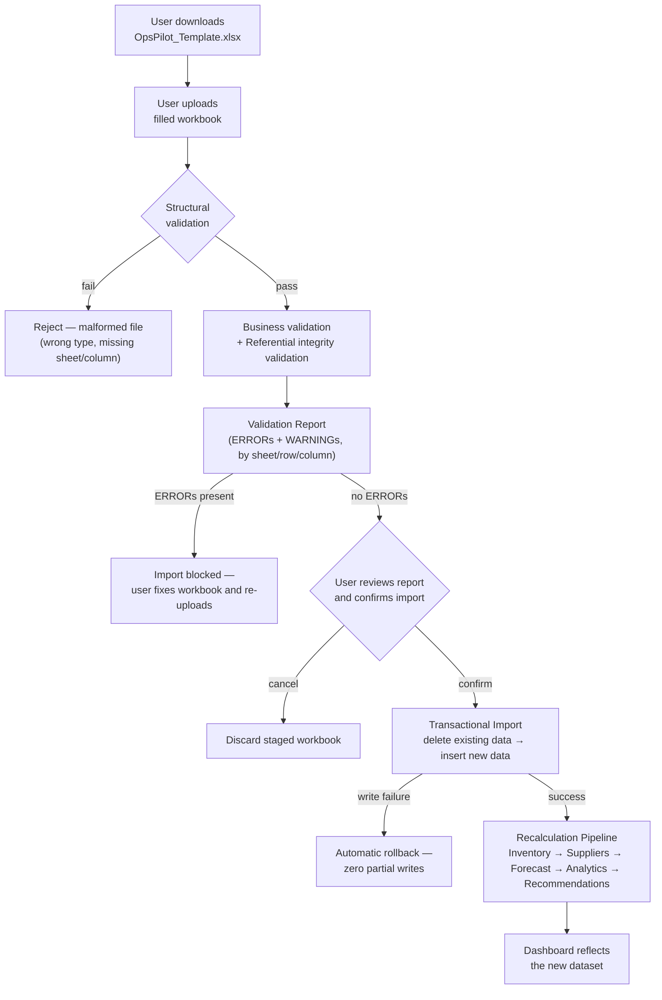
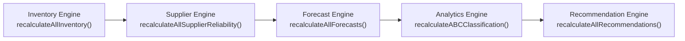

# OpsPilot AI — Data Import Architecture

**Status:** Draft for approval — Phase 3 design, defines the Import Center module before implementation begins
**Audience:** developers implementing the Import Center module (`lib/import/*`, `app/import-center/*`)
**Last updated:** 2026-08-03
**Related:** [SYSTEM_ARCHITECTURE.md](SYSTEM_ARCHITECTURE.md) · [DATA_DICTIONARY.md](DATA_DICTIONARY.md) · [OPERATIONS_ENGINE_SPEC.md](OPERATIONS_ENGINE_SPEC.md) · [prisma/schema.prisma](prisma/schema.prisma)

**This document contains no code and describes no implementation.** It defines the Excel Import Engine's architecture, workbook specification, validation rules, transaction design, and API surface — every decision and failure mode agreed upon before a single line of `lib/import/*` is written, matching the discipline already applied in [OPERATIONS_ENGINE_SPEC.md](OPERATIONS_ENGINE_SPEC.md) before `lib/domain/*` was built.

---

## Purpose

Every module built so far consumes the synthetic NovaFoods dataset created by `prisma/seed.ts`. That dataset is fixed — it demonstrates the product, but a real user (or grader, or interviewer) can only ever look at NovaFoods' numbers, never their own.

Phase 3 removes that limitation. **Import Center** lets a user download a structured Excel template, fill it with their own company's operations data, upload it, and have OpsPilot AI validate it, replace the seeded dataset with it, and regenerate every KPI, chart, forecast, and AI recommendation from it — using the exact same calculation engines already built and tested in Phases 1–2, unmodified.

---

## Design Principles

These carry forward the principles already established in [SYSTEM_ARCHITECTURE.md §1](SYSTEM_ARCHITECTURE.md) and apply them specifically to import:

1. **Business data only.** The Import Center imports only business data. All analytical outputs (Safety Stock, Reorder Point, EOQ, Forecasts, ABC Classification, Supplier Reliability, Operations Health Score, AI Recommendations, etc.) are regenerated by the existing Operations Engines after import and are never uploaded by the user.
2. **Reuse, never duplicate, the Operations Engines.** The import engine's job ends the moment valid data is committed to the database. Every KPI, score, and recommendation is produced by calling the existing `lib/domain/*` orchestrators — the same functions `/api/recalculate` already calls — not by reimplementing any formula.
3. **The workbook is a full replacement, not a patch.** A user uploading their company's data wants *their* dataset, not a merge of their data with NovaFoods' seed data. Import is a full, atomic replace of every operational table — never an incremental upsert. This sidesteps an entire class of ambiguous merge-conflict decisions ("does this row update an existing one or create a new one?") that a real multi-user system would need to solve, but this system doesn't need to, per the same single-dataset scope already documented for the rest of the app.
4. **Validate everything before writing anything.** No row is written to the database until the entire workbook has been checked — structurally, for business rules, and for cross-sheet references. The user sees every problem in the file in one pass, not one error per re-upload cycle.
5. **Fail whole, not partial.** An import either fully succeeds or leaves the database exactly as it was. There is no state where half a workbook has been written.
6. **Resetting is simple, not comprehensive.** There is no import history and no snapshot-based rollback to an arbitrary prior state. Undoing an unwanted import means either re-uploading a corrected workbook or using **Reset to NovaFoods Demo** to return to the original seeded dataset — the same `prisma/seed.ts` script every other milestone already relies on. This keeps the module's state model to exactly two things a user can be in — "the seeded demo" or "an imported dataset" — rather than an import-history feature this project doesn't need.
7. **Explainable, not silent, validation.** Every rejected row names its exact sheet, row number, column, and reason — the same explainability principle already applied to every AI recommendation in this product now applies to every import error.
8. **No infrastructure without a demo reason** (carried forward verbatim from [SYSTEM_ARCHITECTURE.md §1](SYSTEM_ARCHITECTURE.md)). No job queue, no object storage, no background worker — a local file upload and the database transaction Prisma already provides.

---

## 1. Overall Architecture

Five workflows, executed in sequence for a single import:



### 1.1 Upload workflow

The user selects a `.xlsx` file in the Import Center page and submits it to `POST /api/import-center/validate`. The file is never written to the database at this stage — it is parsed into memory, staged to a short-lived temporary location, and handed to the Validation Engine (§3). The response is a `validationId` plus the full Validation Report. Nothing about the existing dataset changes during upload, no matter what the file contains.

### 1.2 Validation workflow

Covered in full in §3. Produces a Validation Report: a list of issues, each tagged `ERROR` (blocks import) or `WARNING` (surfaced, doesn't block). The staged, parsed workbook is kept server-side, keyed by `validationId`, for a short TTL (**Configuration Constant: 15 minutes**) so the user can review the report and confirm without re-uploading the file.

### 1.3 Import workflow

Covered in full in §4. Triggered by `POST /api/import-center/import` with a `validationId` from a report containing no `ERROR`-level issues. Re-validates server-side (§4.1) and performs a single atomic delete-then-insert transaction.

### 1.4 Recalculation workflow

Covered in full in §5. Runs immediately after the import transaction commits, reusing the exact orchestrators `/api/recalculate` already calls, in the same dependency order.

### 1.5 Dashboard refresh workflow

No new mechanism is needed here. Every existing dashboard page is a Server Component that reads live from the database on every request — there is no caching layer to invalidate (per [SYSTEM_ARCHITECTURE.md §1](SYSTEM_ARCHITECTURE.md) principle 5, "no infrastructure without a demo reason"). Once the import and recalculation workflows complete, the very next page load or client-side `router.refresh()` — the same call the existing Recalculate button already makes after `/api/recalculate` finishes — shows the new dataset. No separate "refresh dashboard" step is required.

### 1.6 Technology choice

**`exceljs`** is proposed for both reading uploaded workbooks and generating `OpsPilot_Template.xlsx`. It reads cell-level type information (needed to distinguish a text-formatted number from a real one, per §3.1) and can write Excel data-validation dropdowns into generated cells (needed for §2's enum columns) from a single dependency. SheetJS (`xlsx`) was considered as an alternative for parsing but does not natively author data-validation dropdowns for the template side, which would otherwise require a second library.

---

## 2. Workbook Specification

A single workbook: **`OpsPilot_Template.xlsx`**. One worksheet per entity, plus a non-data instructions tab. Every table below uses each worksheet's exact tab name; the parser matches sheet and column names exactly (case-sensitive) — see §3.1.

**Column naming convention:** template columns use human-readable names (`Product SKU`, not `productId`), because the person filling this workbook is a business user, not a developer. A `*` marks a required column.

**Calculated fields are never collected.** Any field the Operations Engines compute (safety stock, reorder point, stock status, ABC class, supplier reliability score) is deliberately absent from every sheet below — supplying it would imply the workbook, not the engine, is the source of truth for that number, which contradicts this product's core "numbers come from code" principle. The Recalculation Pipeline (§5) populates all of them immediately after import.

**Natural keys, not UUIDs.** The database's real primary keys are UUIDs a business user could never type correctly. Every sheet below uses a human-meaningful natural key instead (a product's SKU, a warehouse's name, a purchase order's own reference number) to cross-reference other sheets — exactly the same resolve-before-write pattern `prisma/seed.ts` already uses to build a fully-wired dataset in memory before touching the database (see [DATA_DICTIONARY.md §2.1](DATA_DICTIONARY.md)). The Import Engine (§4) resolves these natural keys to real UUIDs during the write step; nothing about the underlying schema changes.

### 2.0 `Instructions` (recommended, not parsed)

The first tab in the generated template. Plain-language guidance: what each sheet is for, which are required, the enum values allowed in each dropdown column, and a link back to this document. Not read by the parser — purely for the human filling out the workbook.

---

### 2.1 `Warehouses` — Required

**Purpose:** The distribution centers the uploaded dataset operates out of. Every other sheet that mentions a warehouse refers back to a row here by name.

| Column | Type | Required | Notes |
|---|---|:---:|---|
| Warehouse Name | Text | ✓ | Natural key. Must be unique within this sheet (the database itself does not enforce warehouse name uniqueness — see [DATA_DICTIONARY.md §5.1](DATA_DICTIONARY.md) — so the Import Engine enforces it as a business rule instead) |
| Location | Text | ✓ | Free text, e.g. city/country |
| Capacity Units | Number | ✓ | Must be > 0 |

**Relationships:** referenced by `Inventory.Warehouse Name`, `PurchaseOrders.Warehouse Name`, `InventoryTransactions.Warehouse Name`.

**Validation rules:** Warehouse Name non-blank and unique within the sheet · Capacity Units is numeric and > 0.

**Example row:** `NovaFoods Delhi Distribution Center` | `Delhi, India` | `224447`

---

### 2.2 `Suppliers` — Required

**Purpose:** The vendor directory. Products optionally name a primary supplier here; purchase orders always do.

| Column | Type | Required | Notes |
|---|---|:---:|---|
| Supplier Name | Text | ✓ | Natural key, unique within this sheet (same documented gap as Warehouse Name — see [DATA_DICTIONARY.md §5.5](DATA_DICTIONARY.md)) |
| Contact Email | Text | | Light format check only (contains `@`), never verified for deliverability |
| Contact Phone | Text | | Free text |
| Contracted Lead Time Days | Whole number | ✓ | Must be > 0 |
| Payment Terms | Text | | Free text, e.g. `Net 30` |

**Relationships:** referenced by `Products.Primary Supplier Name` (optional), `PurchaseOrders.Supplier Name`.

**Validation rules:** Supplier Name non-blank and unique · Contracted Lead Time Days is a positive whole number · Contact Email, if present, contains `@`.

**Example row:** `Amrit Agro Foods Pvt. Ltd.` | `procurement@amritagrofoods.in` | `+91-9800000000` | `4` | `Net 30`

---

### 2.3 `Products` — Required

**Purpose:** The SKU catalog. Every other sheet that mentions a product refers back to a row here by SKU.

| Column | Type | Required | Notes |
|---|---|:---:|---|
| SKU | Text | ✓ | Natural key. Maps directly to `Product.sku`, which **is** unique at the database level |
| Product Name | Text | ✓ | |
| Category | Enum dropdown | ✓ | One of `DAIRY`, `BEVERAGES`, `SNACKS`, `BAKERY`, `PERSONAL_CARE`, `HOUSEHOLD`, `FROZEN_FOODS` |
| Unit of Measure | Text | ✓ | e.g. `ml`, `g`, `kg`, `pc` |
| Unit Cost | Number | ✓ | Must be > 0 |
| Unit Price | Number | ✓ | Must be > 0 |
| Lead Time Days | Whole number | ✓ | Must be > 0 |
| Perishable | Boolean dropdown | ✓ | `TRUE` or `FALSE` only |
| Primary Supplier Name | Text | | Optional. If present, must match a row in `Suppliers` |

**Relationships:** referenced by `Inventory.Product SKU`, `DemandHistory.Product SKU`, `PurchaseOrderItems.Product SKU`, `InventoryTransactions.Product SKU`.

**Validation rules:** SKU non-blank and unique · Category exactly matches one of the 7 defined values · Unit Cost and Unit Price numeric and > 0 (**WARNING**, not blocking, if Unit Price < Unit Cost — a legitimate loss-leader is possible, but worth flagging) · Lead Time Days a positive whole number · Perishable is exactly `TRUE` or `FALSE` · Primary Supplier Name, if present, resolves to a `Suppliers` row.

**Example row:** `DAI-0001` | `NovaFresh Toned Milk 500ml` | `DAIRY` | `ml` | `15.00` | `18.83` | `4` | `TRUE` | `Amrit Agro Foods Pvt. Ltd.`

---

### 2.4 `Inventory` — Required

**Purpose:** Current stock on hand — one row per product per warehouse. Everything downstream (stock status, reorder points, health scores) is calculated from this by the Inventory Engine after import; nothing calculated is collected here.

| Column | Type | Required | Notes |
|---|---|:---:|---|
| Product SKU | Text | ✓ | Must resolve to a `Products` row |
| Warehouse Name | Text | ✓ | Must resolve to a `Warehouses` row |
| On-Hand Quantity | Number | ✓ | Must be ≥ 0 |

**Relationships:** `(Product SKU, Warehouse Name)` is a composite natural key, unique within this sheet — mirroring the database's own `@@unique([productId, warehouseId])` constraint on `Inventory` ([DATA_DICTIONARY.md §5.3](DATA_DICTIONARY.md)).

**Validation rules:** both references resolve · On-Hand Quantity numeric and ≥ 0 · `(SKU, Warehouse)` pair not repeated within the sheet.

**Example row:** `DAI-0001` | `NovaFoods Kolkata Distribution Center` | `397`

---

### 2.5 `DemandHistory` — Required

**Purpose:** Historical weekly sales — the ground truth the Forecast Engine trains against and the Inventory Engine's safety stock formula draws its demand variability from.

| Column | Type | Required | Notes |
|---|---|:---:|---|
| Product SKU | Text | ✓ | Must resolve to a `Products` row |
| Period Date | Date | ✓ | Start of the week this row covers |
| Quantity Sold | Number | ✓ | Must be ≥ 0 |

**Relationships:** `(Product SKU, Period Date)` composite natural key, unique within this sheet — mirrors `@@unique([productId, periodDate])` ([DATA_DICTIONARY.md §5.8](DATA_DICTIONARY.md)).

**Validation rules:** SKU resolves · Period Date is a valid date and not in the future · Quantity Sold numeric and ≥ 0 · `(SKU, Period Date)` pair not repeated.

**A product with sparse or no demand history is not a validation error.** Per [OPERATIONS_ENGINE_SPEC.md §4.2](OPERATIONS_ENGINE_SPEC.md), the Inventory Engine already treats "fewer than 2 weeks of history" as a defined edge case — the affected product's safety stock and reorder point simply compute as `null` ("insufficient data"), not as an import failure. The sheet is required to exist (so the engines have *some* company-wide demand signal to work from), but individual products are allowed thin coverage.

**Example row:** `DAI-0001` | `2025-02-03` | `835`

---

### 2.6 `PurchaseOrders` — Optional

**Purpose:** Order history — the input to supplier reliability scoring and the Procurement module's order tracking. Optional because a brand-new operation may have no order history yet; the Supplier Engine already handles that gracefully (§3.2).

| Column | Type | Required | Notes |
|---|---|:---:|---|
| PO Reference | Text | ✓ | Natural key, unique within this sheet — a workbook-only cross-reference, not itself stored verbatim in the database (the database still generates its own UUID primary key, exactly as `prisma/seed.ts` already does) |
| Supplier Name | Text | ✓ | Must resolve to a `Suppliers` row |
| Warehouse Name | Text | ✓ | Must resolve to a `Warehouses` row |
| Status | Enum dropdown | ✓ | One of `DRAFT`, `SUBMITTED`, `APPROVED`, `IN_TRANSIT`, `RECEIVED`, `CANCELLED` |
| Order Date | Date | ✓ | |
| Expected Delivery Date | Date | | |
| Actual Delivery Date | Date | | Required if Status = `RECEIVED` |

**Relationships:** referenced by `PurchaseOrderItems.PO Reference`.

**Validation rules:** Supplier Name and Warehouse Name resolve · Status matches exactly one of the 6 values · Order Date is a valid date · if Status = `RECEIVED`, Actual Delivery Date must be present · if Expected/Actual Delivery Date are present, each should be ≥ Order Date (**WARNING** if violated — a backdated correction is plausible real-world data, not necessarily an error) · PO Reference unique within the sheet.

**Example row:** `PO-00001` | `Amrit Agro Foods Pvt. Ltd.` | `NovaFoods Delhi Distribution Center` | `RECEIVED` | `2026-06-06` | `2026-06-10` | `2026-06-08`

---

### 2.7 `PurchaseOrderItems` — Optional (required only if `PurchaseOrders` has rows)

**Purpose:** Line items within each purchase order — one row per product ordered on a PO.

| Column | Type | Required | Notes |
|---|---|:---:|---|
| PO Reference | Text | ✓ | Must resolve to a `PurchaseOrders` row |
| Product SKU | Text | ✓ | Must resolve to a `Products` row |
| Quantity | Number | ✓ | Must be > 0 |
| Unit Cost | Number | ✓ | Cost at time of order — may differ from the product's current catalog `Unit Cost` |

**Relationships:** many rows per `PO Reference`.

**Validation rules:** both references resolve · Quantity and Unit Cost numeric and > 0 · every `PO Reference` in `PurchaseOrders` should have at least one item row (**WARNING** — an order with zero line items is unusual but not itself invalid data).

**Example row:** `PO-00001` | `DAI-0001` | `2458` | `14.44`

---

### 2.8 `InventoryTransactions` — Optional

**Purpose:** An audit trail of stock movements, matching the existing `InventoryTransaction` table's role as an explainability log, not a complete sales ledger (see [DATA_DICTIONARY.md §5.4](DATA_DICTIONARY.md), which documents the same scope limitation in the seed data).

| Column | Type | Required | Notes |
|---|---|:---:|---|
| Product SKU | Text | ✓ | Must resolve to a `Products` row |
| Warehouse Name | Text | ✓ | The `(SKU, Warehouse)` pair must exist as a row in `Inventory` |
| Transaction Type | Enum dropdown | ✓ | One of `PURCHASE`, `SALE`, `TRANSFER_IN`, `TRANSFER_OUT`, `RETURN`, `ADJUSTMENT` |
| Quantity | Number | ✓ | Signed, non-zero — see [DATA_DICTIONARY.md §4](DATA_DICTIONARY.md) for the sign convention per type |
| Reference | Text | | Free text, e.g. a PO reference |
| Notes | Text | | Free text |
| Transaction Date | Date | ✓ | Must not be in the future |

**Relationships:** resolves to the `Inventory` row for `(Product SKU, Warehouse Name)`.

**Validation rules:** `(SKU, Warehouse)` pair exists in `Inventory` · Transaction Type matches exactly one of the 6 values · Quantity numeric and non-zero · sign matches the type's documented convention (**WARNING** if not — `ADJUSTMENT` legitimately allows either sign, so this is never hard-blocked) · Transaction Date valid and not in the future.

**Example row:** `DAI-0001` | `NovaFoods Delhi Distribution Center` | `PURCHASE` | `2458` | `PO-00001` | *(blank)* | `2026-06-08`

**If this sheet is omitted or empty**, the Import Engine auto-generates one opening `ADJUSTMENT` transaction per `Inventory` row (quantity = that row's On-Hand Quantity, notes = `"Opening balance from import"`) — preserving the existing business rule that on-hand stock should reconcile with transaction history ([DATA_DICTIONARY.md §7](DATA_DICTIONARY.md), rule 3) from the moment the dataset exists, without forcing every user to hand-author a full transaction history just to get started.

---

### 2.9 Sheet summary

| Sheet | Required | Depends on |
|---|:---:|---|
| Instructions | — (not parsed) | — |
| Warehouses | ✓ | — |
| Suppliers | ✓ | — |
| Products | ✓ | Suppliers (optional reference) |
| Inventory | ✓ | Products, Warehouses |
| DemandHistory | ✓ | Products |
| PurchaseOrders | Optional | Suppliers, Warehouses |
| PurchaseOrderItems | Optional* | PurchaseOrders, Products (*required if PurchaseOrders has rows) |
| InventoryTransactions | Optional | Products, Warehouses, Inventory |

**Enum sources are shared, not duplicated.** Both the template generator's dropdown lists and the validation engine's allowed-value checks read from the same place — the Prisma-generated enum objects at `lib/generated/prisma/enums` already used by the API validation layer (`lib/api/http.ts`, see the audit that added it). A category, status, or transaction type can never drift out of sync between the template and the validator, because there is only one list.

---

## 3. Validation Engine

Every issue the validator finds is a `ValidationIssue`: a severity (`ERROR` blocks import; `WARNING` is surfaced but does not), a sheet name, a 1-indexed row number matching the actual Excel row, a column name, a human-readable message naming the actual offending value, and a stable rule code (e.g. `PRODUCT_SKU_DUPLICATE`) for consistent testing and future tooling. This mirrors the `RecommendationSeverity` vocabulary the rest of the product already uses (`CRITICAL`/`WARNING`/`INFO`) — reduced here to two levels, since a data-import error is either blocking or it isn't; there's no "informational" tier for a spreadsheet cell.

**The validator always runs to completion.** It does not stop at the first error. Every issue in the entire workbook is collected and returned in one Validation Report, so a user fixing their file does not have to re-upload once per mistake.

Validation runs in three passes, in order — each pass only runs if the previous one found no blocking issues (there is no point checking whether a SKU reference resolves if the `Products` sheet itself is missing its header row).

### 3.1 Structural validation

Checks the file itself, before any business meaning is applied.

| Rule | Severity |
|---|---|
| File is a valid, parseable `.xlsx` (not corrupted, not a renamed non-Excel file) | ERROR |
| File size within the configured limit (**Configuration Constant: 25 MB**) | ERROR |
| Every Required sheet from §2.9 is present, with an exact (case-sensitive) name match | ERROR |
| Every required column in a present sheet is present, with an exact header match, on row 1 | ERROR |
| A Required sheet has at least one data row | ERROR |
| A required cell in a required column is non-blank | ERROR |
| A numeric column's cells are stored as actual numbers, not text | ERROR |
| A date column's cells are stored as actual dates, not text | ERROR |
| An enum-dropdown column's cell exactly matches one of its allowed values | ERROR |

### 3.2 Business validation

Checks a single row's or single sheet's internal consistency — no cross-sheet lookups yet. The specific rule per column is listed in each sheet's table in §2; consolidated here by category:

- **Uniqueness of natural keys within a sheet**: Warehouse Name, Supplier Name, Product SKU, `(Product SKU, Warehouse Name)` in Inventory, `(Product SKU, Period Date)` in DemandHistory, PO Reference. All ERROR on violation.
- **Numeric ranges**: Capacity Units, Unit Cost, Unit Price, On-Hand Quantity, Quantity Sold, PurchaseOrderItem Quantity/Unit Cost — each checked against the ≥ 0 or > 0 bound specified per column in §2. ERROR on violation.
- **Whole-number fields**: Lead Time Days, Contracted Lead Time Days — must be integers. ERROR on violation.
- **Boolean fields**: Perishable must be exactly `TRUE` or `FALSE`. ERROR on violation.
- **Date sanity**: DemandHistory Period Date and InventoryTransactions Transaction Date must not be in the future. ERROR on violation. PurchaseOrder date ordering (Expected/Actual ≥ Order Date) is checked but downgraded to WARNING, since real-world backdated corrections exist.
- **Conditional requirements**: a PurchaseOrder with Status = `RECEIVED` must have an Actual Delivery Date. ERROR on violation.
- **Soft business signals**: Unit Price < Unit Cost; a PurchaseOrder with zero line items; an InventoryTransaction quantity sign that doesn't match its type's usual convention. All WARNING — plausible in real data, worth a human's attention, never worth blocking an entire import over.

### 3.3 Referential integrity validation

Checks that every natural-key reference in every sheet actually resolves to a row somewhere else in the same workbook. All violations are ERROR, since an unresolvable reference cannot be written to the database at all (the corresponding foreign key would have nothing to point to).

| Reference | Must exist in |
|---|---|
| `Products.Primary Supplier Name` (if present) | `Suppliers.Supplier Name` |
| `Inventory.Product SKU` | `Products.SKU` |
| `Inventory.Warehouse Name` | `Warehouses.Warehouse Name` |
| `DemandHistory.Product SKU` | `Products.SKU` |
| `PurchaseOrders.Supplier Name` | `Suppliers.Supplier Name` |
| `PurchaseOrders.Warehouse Name` | `Warehouses.Warehouse Name` |
| `PurchaseOrderItems.PO Reference` | `PurchaseOrders.PO Reference` |
| `PurchaseOrderItems.Product SKU` | `Products.SKU` |
| `InventoryTransactions.(Product SKU, Warehouse Name)` | `Inventory.(Product SKU, Warehouse Name)` |

### 3.4 Presenting validation errors

The Validation Report returned to the Import Center page (§6.4) groups issues first by sheet, then by severity, then by row — the same order a user reading their own spreadsheet top-to-bottom would expect. Each row in the report shows the rule code, severity badge, sheet, cell reference (e.g. `Products!C14`), and message (e.g. *"Category 'Dairy' does not match any of DAIRY, BEVERAGES, SNACKS, BAKERY, PERSONAL_CARE, HOUSEHOLD, FROZEN_FOODS"*). A summary line at the top states the total ERROR and WARNING counts and whether import is currently blocked. The report can be downloaded as a workbook of its own (one row per issue, same columns) so a user can work through it in Excel side-by-side with the file they uploaded — the import blocks on ERRORs; WARNINGs require an explicit acknowledgement checkbox before the **Confirm Import** action is enabled, but never block it outright.

---

## 4. Import Engine

### 4.1 Execution order

Triggered by `POST /api/import-center/import { validationId }`. Exact sequence:

1. **Re-validate server-side.** The staged workbook behind `validationId` is re-run through the full three-pass Validation Engine (§3) before anything is written — defense in depth, the same "never trust a prior client-visible state" discipline already applied to every other API route (`lib/api/http.ts`). If the `validationId` has expired or no longer exists, the import is refused with a clear "please re-upload" error, not a generic failure.
2. **Open one Prisma transaction** covering every write below. Nothing outside this transaction touches the database.
   - **Delete existing data**, in the exact order required by the schema's own foreign-key constraints (children before parents, so no `ON DELETE RESTRICT` constraint is ever violated):

     ```mermaid
     flowchart TD
         D1["1. AIRecommendation"] --> D2["2. InventoryTransaction"]
         D2 --> D3["3. PurchaseOrderItem"]
         D3 --> D4["4. Forecast"]
         D4 --> D5["5. DemandHistory"]
         D5 --> D6["6. Inventory"]
         D6 --> D7["7. PurchaseOrder"]
         D7 --> D8["8. Product"]
         D8 --> D9["9. Supplier"]
         D9 --> D10["10. Warehouse"]
     ```

     `AIRecommendation` is cleared first regardless of order (its foreign keys are all `SET NULL`, so it never blocks anything) simply to fully clear derived data up front. `InventoryTransaction` must precede `Inventory` (`ON DELETE RESTRICT`, per [DATA_DICTIONARY.md §5.4](DATA_DICTIONARY.md)); `PurchaseOrderItem` must precede `Product` (`ON DELETE RESTRICT`, per §5.7); `PurchaseOrder` must precede `Supplier` and `Warehouse` (`ON DELETE RESTRICT`, per §5.6).
   - **Insert new data**, in exactly the reverse order — parents before children — resolving every natural-key reference from §2 to the newly generated UUIDs as each row is created: `Warehouse` → `Supplier` → `Product` → `Inventory` → `DemandHistory` → `PurchaseOrder` → `PurchaseOrderItem` → `InventoryTransaction` (or the auto-generated opening balances from §2.8 if that sheet was empty).
3. **Commit.** If any step in 2 throws — a constraint the validator didn't catch, a driver error, anything — Prisma rolls back the entire transaction automatically. The database is left byte-for-byte as it was before step 2 began, and the user sees a clear error describing what failed (§9).
4. **Trigger the Recalculation Pipeline** (§5) — only after the transaction has committed. This is a deliberately separate step, not part of the transaction above (see §5 for why).

### 4.2 Why "full replace," not "upsert"

An incremental upsert would need a stable natural key for every entity to decide "update this row" vs. "create a new one" — but, per §2.1/§2.2, `Warehouse.name` and `Supplier.name` are not even unique at the database level today. Defining upsert semantics correctly would mean either changing the schema (out of scope — this document changes no existing code or schema) or inventing a fragile heuristic. A full replace avoids the question entirely and matches the stated purpose exactly: *replace* the seeded dataset with the user's own.

---

## 5. Recalculation Pipeline

**No calculation is duplicated.** This stage does nothing but call the same five orchestrators `POST /api/recalculate` already calls, in the same already-established dependency order, because the reasoning for that order hasn't changed — Recommendations still reads the output of every engine before it:



This is intentionally the *same function calls*, not a parallel implementation — the Import Center module has no calculation logic of its own to maintain or keep in sync.

**Recalculation failure does not undo the import.** By the time this stage runs, the raw imported data is already committed and valid — only the *derived* fields (safety stock, reorder points, reliability scores, forecasts, recommendations) are pending. If a stage throws partway through, the stages before it have already committed their results, exactly as already documented for `/api/recalculate` itself:

> *"If a stage throws, everything before it has already committed — the response reports which stages completed rather than claiming an all-or-nothing guarantee that isn't there."* — `app/api/recalculate/route.ts`

A failed recalculation can simply be retried via the existing Recalculate action, with no need to re-import anything.

---

## 6. Import Center Module

A new dashboard page, `/import-center`, following the same page structure as every other module (`page.tsx` + `loading.tsx`, reading through a `lib/presentation/importCenterData.ts` composition module — see §7).

### 6.1 Current Dataset

A summary panel, structurally similar to the Executive Dashboard's KPI row: row counts for each entity (products, warehouses, suppliers, inventory positions, demand history rows, purchase orders), and the timestamp of the last recalculation (`MAX(Inventory.lastCalculatedAt)` — an already-existing column, per [DATA_DICTIONARY.md §5.3](DATA_DICTIONARY.md); no new field needed). This is the answer to "what data is this app currently showing me?"

### 6.2 Import Dataset

A file drop zone / picker accepting only `.xlsx`. Submitting a file drives the Upload → Validation workflow (§1.1–§1.2) and transitions the page into the Validation Report view (§6.4). No dataset changes until the user explicitly confirms.

### 6.3 Download Template

A single button, `GET /api/import-center/template`, streaming a freshly generated `OpsPilot_Template.xlsx` (§2) — including the `Instructions` tab, header rows, and enum dropdowns, generated from the same sheet/column/enum definitions the validator itself uses, so the template can never silently drift out of sync with what the validator will actually accept.

### 6.4 Validation Report

Shown after a file is uploaded. Renders the grouped issue list from §3.4, a summary count, a **Download Report** action, and — only enabled once there are zero ERRORs — a **Confirm Import** action (which requires an explicit acknowledgement if WARNINGs are present). A **Cancel** action discards the staged workbook and returns to the Import Dataset view.

### 6.5 Reset to NovaFoods Demo

A single button that discards the currently imported dataset and restores the original seeded demonstration data. Internally, it reuses the exact table-clearing order already defined for Import (§4.1) — no separate deletion logic — then invokes the existing `prisma/seed.ts` script exactly as `npm run db:seed` already does, wrapped in the same transactional discipline as Import so a failure leaves the previous dataset intact rather than a half-cleared database (§9). This is not a history-aware rollback to an arbitrary previous import — per Design Principle 6, there is no import history to roll back to — it always returns to the same fixed NovaFoods dataset. Requires confirmation, since it discards whatever dataset is currently loaded.

---

## 7. Folder Structure

Follows the existing project's established conventions exactly — `lib/domain` for pure logic, `lib/presentation` for page data composition, `lib/api` for shared API concerns, `app/<module>/` for pages, `app/api/<module>/` for routes, `components/<module>/` for UI:

```
lib/
├── import/                              # New — the Import Center's Excel Import Engine
│   ├── workbookSchema.ts                 # Sheet/column/validation definitions from §2 — single source of truth
│   ├── parseWorkbook.ts                  # Reads an uploaded file into structured, typed rows
│   ├── structuralValidation.ts           # §3.1
│   ├── businessValidation.ts             # §3.2
│   ├── referentialValidation.ts          # §3.3
│   ├── validationReport.ts               # Combines issues from all three passes, assigns severities
│   ├── importTransaction.ts              # The delete-then-insert sequence from §4.1 — also reused by Reset to NovaFoods Demo (§6.5)
│   └── templateGenerator.ts              # Produces OpsPilot_Template.xlsx from workbookSchema.ts
├── presentation/
│   └── importCenterData.ts               # Current Dataset summary — same pattern as every other *Data.ts module
├── api/
│   └── http.ts                           # Unchanged — reused as-is for this module's routes too
└── domain/                               # Unchanged — the Recalculation Pipeline and Reset both call straight into here
app/
├── import-center/
│   ├── page.tsx
│   └── loading.tsx
└── api/
    └── import-center/
        ├── route.ts                      # GET — Current Dataset summary
        ├── template/route.ts             # GET — download the template
        ├── validate/route.ts             # POST — upload + validate, no write
        ├── import/route.ts               # POST — commit a validated import
        └── reset-demo/route.ts           # POST — clear imported data and reseed NovaFoods
components/
└── import-center/
    ├── dataset-summary.tsx
    ├── upload-dropzone.tsx
    ├── validation-report-table.tsx
    └── reset-demo-dialog.tsx
```

No schema changes are proposed for this module — without import history or logging, the Import Center needs no table of its own; it only reads and writes the existing operational tables already defined in `prisma/schema.prisma`.

---

## 8. API Design

Follows the same consolidated, page-oriented convention as the rest of the app ([SYSTEM_ARCHITECTURE.md §7](SYSTEM_ARCHITECTURE.md)) — one route per Import Center action, each a thin wrapper delegating to `lib/import/*` or `lib/presentation/importCenterData.ts`, sharing the existing `withRouteErrorHandling` error envelope from `lib/api/http.ts`.

| Method | Endpoint | Purpose |
|---|---|---|
| GET | `/api/import-center` | Current Dataset summary — row counts, last recalculation timestamp |
| GET | `/api/import-center/template` | Download a freshly generated `OpsPilot_Template.xlsx` |
| POST | `/api/import-center/validate` | Upload a workbook; run structural, business, and referential validation; stage it server-side; return a `validationId` and the full Validation Report |
| POST | `/api/import-center/import` | Commit a previously validated workbook (`{ validationId }`): re-validate, transactional replace, then trigger recalculation |
| POST | `/api/import-center/reset-demo` | Clear the current dataset and reseed the original NovaFoods demonstration data, using the existing `prisma/seed.ts` script |

---

## 9. Error Handling

Organized by the workflow stage in which each failure can occur.

**Upload**
| Scenario | Response |
|---|---|
| Wrong file type / extension | Rejected before parsing — "Please upload a .xlsx file" |
| File exceeds the size limit | Rejected with the configured limit stated |
| Corrupted or unreadable `.xlsx` | Parser failure caught and reported as a structural ERROR (§3.1), never an unhandled 500 — same `ApiError` / `withRouteErrorHandling` pattern already used across every other route |
| Empty workbook (no sheets, or all sheets blank) | Structural ERROR |

**Validation**
| Scenario | Response |
|---|---|
| Missing required sheet or column | Structural ERROR, blocks; the rest of validation does not run until this is fixed |
| Any invalid cell | Collected as one issue; validation continues to the end of the workbook regardless |
| Referential integrity failure | ERROR, blocks, names the exact unresolved reference |
| Duplicate natural key within a sheet | ERROR, blocks, names both conflicting rows |
| `validationId` expired or unknown at import time | Distinct, explicit "please re-upload and re-validate" error — never a generic failure |

**Import**
| Scenario | Response |
|---|---|
| Data changed between validate and import (re-validation at import time finds a new issue) | Import refused; user must re-validate |
| Write failure mid-transaction (unexpected constraint, driver error, disk full) | Automatic transaction rollback — zero partial writes; the user sees a clear error describing what failed |

**Recalculation**
| Scenario | Response |
|---|---|
| An engine orchestrator throws partway through | Import remains committed (raw data is valid); the user retries recalculation independently via the existing Recalculate action — no re-import needed |

**Reset to NovaFoods Demo**
| Scenario | Response |
|---|---|
| Reset fails partway (clear or reseed step throws) | Same transactional discipline as Import (§4) — wrapped in one transaction, automatic rollback, the previous dataset is left exactly as it was |

**Concurrency**
| Scenario | Response |
|---|---|
| A second import or reset is requested while one is already running | Refused with "an import is already in progress" — enforced by a simple in-process flag on the server, not a persisted lock (this is a single-instance, single-writer SQLite app; nothing more is needed) |

---

## 10. Future Extensions

Explicitly out of scope for this design — listed here as deliberate boundaries, not implied gaps, consistent with how the rest of the project documents its own scope:

- **Multiple datasets.** Today's design assumes exactly one live dataset, matching the whole application's existing single-company, no-tenancy scope ([SYSTEM_ARCHITECTURE.md §4](SYSTEM_ARCHITECTURE.md)). Supporting several named, switchable datasets would need the same kind of tenancy-scoping layer already flagged as out of scope for the entire app, not just this module.
- **Scheduled imports.** Would require a job scheduler — explicitly already listed as removed from this project's stack ([SYSTEM_ARCHITECTURE.md §2](SYSTEM_ARCHITECTURE.md), "Explicitly removed from the stack"). Every import today is a manual, user-initiated action.
- **Cloud storage.** Uploaded workbooks are staged as a local, temporary file today. A hosted deployment would need to stage uploads through an object-storage-backed equivalent (e.g., S3-compatible storage) instead — a swap at the storage boundary, not a redesign of the import/validation/recalculation logic itself.
- **CSV support.** Would trade the workbook's single-file, cross-sheet natural-key referencing (§2) and native dropdown validation (§2.9) for a set of separate per-entity files with no equivalent built-in cross-file consistency checking — a materially different, weaker validation story, not a simple format swap.
