# OpsPilot AI — Development Roadmap

**Status:** Draft for approval (v2 — simplified academic scope)
**Last updated:** 2026-08-02
**Related:** [PROJECT_PLAN.md](./PROJECT_PLAN.md) · [PRODUCT_REQUIREMENTS_DOCUMENT.md](./PRODUCT_REQUIREMENTS_DOCUMENT.md) · [SYSTEM_ARCHITECTURE.md](./SYSTEM_ARCHITECTURE.md)

---

## Roadmap Philosophy

Sized for **one student, working solo, over roughly 6–8 weeks of part-time effort** (adjust to your own pace — the point is the ordering and independence of phases, not the calendar). Each phase produces a working, demoable increment. There is no separate "productionization" phase in this version — everything here is either core to the demo or explicitly deferred to Phase 8 (Stretch, not required).

Effort units are **relative sizing** (S/M/L) per task.

---

## Phase 0 — Documentation & Architecture *(current phase)*

**Goal:** Fully define the product, at the right scope, before any application code is written.

| Deliverable | Status |
|---|---|
| PROJECT_PLAN.md | ✅ Complete (v2) |
| PRODUCT_REQUIREMENTS_DOCUMENT.md | ✅ Complete (v2) |
| SYSTEM_ARCHITECTURE.md | ✅ Complete (v2) |
| DEVELOPMENT_ROADMAP.md | ✅ Complete (v2) |

**Exit criteria:** User explicitly approves this documentation set.

---

## Phase 1 — Foundation *(~3–5 days)*

**Goal:** Project scaffold, data model, and the NovaFoods synthetic dataset in place. Nothing pretty yet, but the data is real and correct.

| Task | Effort |
|---|---|
| Initialize Next.js + TypeScript + Tailwind + shadcn/ui project | S |
| Define Prisma schema for core entities (Warehouse, SKU, InventoryStock, StockMovement, Supplier, SupplierSKU, PurchaseOrder, PurchaseOrderLine, DemandHistory, Forecast, Recommendation) | M |
| Set up SQLite via Prisma + initial migration | S |
| Build the NovaFoods seed script: 4 warehouses, ~200 SKUs across 4 categories, ~20 suppliers, 18 months of realistic demand history with seasonality/noise, initial stock levels, historical stock movements and POs | L |
| Sanity-check seed data (row counts, no orphaned FKs, plausible value ranges) with a quick script | S |

**Exit criteria:** `npm run seed` populates a local database with a complete, internally consistent NovaFoods dataset; it can be queried and browsed (e.g., via Prisma Studio) and looks realistic.

---

## Phase 2 — Core Data Modules: Inventory, Procurement, Suppliers *(~1–1.5 weeks)*

**Goal:** Build the three modules that hold and display raw operational data — no calculated intelligence yet, just clean, correct, well-designed views. This is the "system of record" layer the intelligence layer sits on top of.

| Task | Effort |
|---|---|
| Inventory Intelligence: SKU catalog list (filter/sort by category, warehouse) | M |
| Inventory Intelligence: SKU detail view with stock trend chart | M |
| Procurement: PO list + detail view | M |
| Procurement: PO create/edit form (manual quantity for now — EOQ pre-fill comes in Phase 3) | M |
| Suppliers: supplier list + profile view | M |
| Suppliers: SKU-supplier linking display | S |
| Shared UI components: KPI tile, status badge, data table, chart wrapper | M |
| CSV export endpoint + button for each entity | S |

**Exit criteria:** A user can browse and manage every piece of raw NovaFoods operational data across these three modules with a clean, responsive UI — no AI, no calculated metrics yet.

---

## Phase 3 — OM Calculation Engine *(~1 week)*

**Goal:** Implement the deterministic domain logic that is the academic core of the project, fully isolated and unit-tested.

| Task | Effort |
|---|---|
| `lib/domain/inventory`: Safety Stock, ROP, Days of Supply, Stock Status classification | M |
| `lib/domain/inventory`: ABC classification | S |
| `lib/domain/procurement`: EOQ calculation | S |
| `lib/domain/suppliers`: Reliability scoring (on-time %, accuracy, lead time variance, price stability) | M |
| Unit tests (Vitest) for every formula against hand-computed reference values | M |
| Wire calculated values into Inventory Intelligence (Safety Stock/ROP/Status columns, calculation breakdown on SKU detail) | M |
| Wire EOQ into the Procurement PO creation form (pre-fill + show formula inputs) | S |
| Wire reliability score into Supplier profile/scorecard | S |
| `POST /api/recalculate` endpoint to manually rerun the engine and persist updated derived values | S |

**Exit criteria:** Every module now shows live-calculated, formula-backed metrics instead of raw numbers, and each formula is verifiably correct via unit tests.

---

## Phase 4 — Demand Forecasting *(~4–6 days)*

**Goal:** Add the forecasting module and feed its output back into inventory calculations.

| Task | Effort |
|---|---|
| `lib/domain/forecasting`: Moving average forecaster | M |
| `lib/domain/forecasting`: Exponential smoothing forecaster | M |
| `lib/domain/forecasting`: Backtest harness (MAPE/MAE) + auto-select best method per SKU | M |
| Demand Forecasting module UI: forecast vs. actual chart, horizon selector, accuracy display | M |
| Feed forecast-derived demand variability into Safety Stock/ROP (closing the loop from Phase 3) | S |
| Unit tests for forecasting math against a known synthetic series | M |

**Exit criteria:** Forecasting module produces believable forecasts with visible accuracy metrics, and Inventory Intelligence's safety stock numbers now reflect forecasted demand variability, not just historical averages.

---

## Phase 5 — Operations Copilot (AI) *(~1 week)*

**Goal:** Build the AI layer — the recommendation feed and the grounded chat interface — on top of the now-complete calculation engine.

| Task | Effort |
|---|---|
| `lib/domain/recommendations`: rule engine (candidates from ROP breaches, low reliability, forecast risk, ABC-weighted prioritization) | L |
| Claude API client (`lib/ai`) + prompt template for recommendation narration | M |
| `GET /api/recommendations` wired to rule engine + Claude narration, with graceful degradation if Claude is unreachable | M |
| Recommendation feed UI: list, filter by module/severity, Accept/Dismiss/Snooze (session-level state) | M |
| Grounded chat: scope-detection logic (map a question to the relevant metric slice) | M |
| `POST /api/copilot/chat` + prompt template that grounds Claude in the fetched metrics only | M |
| Copilot chat UI with source-metrics expandable under each answer | M |

**Exit criteria:** The Operations Copilot module produces ranked, explainable, AI-narrated recommendations traceable to real metrics, and answers free-text questions grounded in the same data — this completes the demo's core intelligence story.

---

## Phase 6 — Executive Dashboard & Analytics *(~4–6 days)*

**Goal:** Tie every module together into the two modules that make the demo feel like a coherent product rather than a set of screens.

| Task | Effort |
|---|---|
| Executive Dashboard: KPI tiles (service level, turnover, avg. reliability, open PO value, at-risk SKU count) | M |
| Executive Dashboard: "Needs Attention" top-N list sourced from the recommendation feed | S |
| Executive Dashboard: 90-day trend sparklines | S |
| Cosmetic persona switcher affecting KPI/recommendation emphasis on the dashboard | S |
| Analytics: cross-module trend views (turnover, service level, warehouse utilization, COGS vs. demand) | M |
| Analytics: supplier network view (reliability distribution, single-supplier concentration risk) | M |
| Analytics: warehouse utilization view (folds in the "warehouse monitoring" concept without a standalone module) | M |

**Exit criteria:** The Executive Dashboard gives a convincing 30-second overview of NovaFoods' operations, and Analytics supports a deeper "prove it to me" drill-down — this closes the MVP.

---

## Phase 7 — Polish & Wrap-Up *(~3–5 days)*

**Goal:** Make it presentable and submittable.

| Task | Effort |
|---|---|
| Responsive/tablet layout pass across all 7 modules | M |
| Empty/loading/error states polish | S |
| Optional cosmetic login screen (single shared demo password) for SaaS look-and-feel | S |
| Consistent navigation shell + branding (logo, color system) | M |
| Final data sanity pass (make sure every chart tells a believable NovaFoods story) | S |
| README with setup instructions, formula reference, and architecture summary for graders/reviewers | S |
| Optional: deploy to Vercel with hosted Postgres for a live demo link | M |

**Exit criteria:** OpsPilot AI is a polished, coherent, end-to-end demo suitable for an academic presentation or portfolio, runnable locally with a single `npm install && npm run seed && npm run dev`.

---

## Phase 8 — Stretch (Not Required)

| Idea | Notes |
|---|---|
| Persisted recommendation Accept/Dismiss history | Currently session-level only |
| Adjustable reliability-score weighting exposed in UI | Currently a visible but static config |
| What-if simulator (e.g., "what if lead time increases 3 days?") | Nice extension of the domain layer, not required for MVP |
| Real login + reintroducing any Phase-6-removed production concerns | Only if this ever became a real product — see SYSTEM_ARCHITECTURE §13 |

---

## Timeline Summary

```mermaid
gantt
    title OpsPilot AI Development Phases (relative sequencing)
    dateFormat  X
    axisFormat %s
    section Docs
    Phase 0 - Docs & Architecture         :done, p0, 0, 1
    section Build
    Phase 1 - Foundation & Seed Data      :p1, after p0, 1
    Phase 2 - Inventory/Procurement/Suppliers :p2, after p1, 2
    Phase 3 - OM Calculation Engine       :p3, after p2, 1
    Phase 4 - Demand Forecasting          :p4, after p3, 1
    Phase 5 - Operations Copilot (AI)     :p5, after p4, 1
    Phase 6 - Dashboard & Analytics       :p6, after p5, 1
    Phase 7 - Polish & Wrap-Up            :p7, after p6, 1
    section Optional
    Phase 8 - Stretch                     :p8, after p7, 2
```

---

## Definition of "Demo Complete"

The project (Phases 1–7) is complete when:

1. All 7 modules are functional and navigable against the NovaFoods dataset.
2. Safety stock, ROP, EOQ, ABC classification, supplier reliability, and demand forecasts are all calculated correctly (verified by unit tests against hand-computed reference values).
3. The Operations Copilot produces ranked, explainable, AI-narrated recommendations and answers grounded free-text questions — both traceable to underlying metrics.
4. The Executive Dashboard and Analytics modules tie the story together at a glance and in depth, respectively.
5. The app runs end-to-end from a clean checkout with `npm install && npm run seed && npm run dev`.

---

## Next Step

Awaiting explicit approval of the revised documentation set before Phase 1 implementation begins:
- [PROJECT_PLAN.md](./PROJECT_PLAN.md)
- [PRODUCT_REQUIREMENTS_DOCUMENT.md](./PRODUCT_REQUIREMENTS_DOCUMENT.md)
- [SYSTEM_ARCHITECTURE.md](./SYSTEM_ARCHITECTURE.md)
- [DEVELOPMENT_ROADMAP.md](./DEVELOPMENT_ROADMAP.md)
