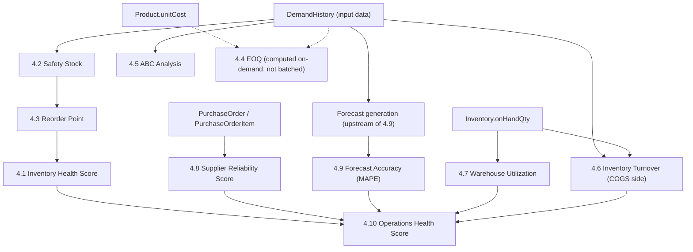

# OpsPilot AI — Operations Engine Specification

**Status:** Draft for approval — defines every calculation before implementation begins
**Audience:** developers implementing `lib/domain/*` (the Operations Engine milestone)
**Last updated:** 2026-08-02
**Related:** [DATA_DICTIONARY.md](DATA_DICTIONARY.md) · [PRODUCT_REQUIREMENTS_DOCUMENT.md](PRODUCT_REQUIREMENTS_DOCUMENT.md) · [SYSTEM_ARCHITECTURE.md](SYSTEM_ARCHITECTURE.md) · [prisma/schema.prisma](prisma/schema.prisma)

**This document contains no code.** Formulas are written in plain mathematical notation. It exists so that every number the Operations Engine will ever produce is agreed upon — inputs, edge cases, and business rules — before a single line of `lib/domain` is written.

---

## 1. Purpose & Scope

`prisma/seed.ts` (Milestone 1.3) already computes several of these metrics — but as **one-off generation math local to the seed script**, not as reusable, tested, importable business logic. This spec defines the formulas the *real* Operations Engine must implement, so that:

1. The seed script's numbers and the engine's numbers are provably the same formula, not two independently-invented approximations that happen to look similar.
2. Every formula is checked against what the current schema can actually supply — no metric below assumes data that doesn't exist without saying so explicitly.
3. Every dashboard widget and every AI recommendation that will eventually consume these numbers has a clear, traceable source.

## 2. How to Read Each Metric Entry

Every metric below follows the same structure:

- **Business Purpose** — why this number exists, in plain language
- **Formula** — the exact calculation
- **Inputs** — which schema fields (or configuration constants) feed it
- **Outputs** — what's produced, and where (if anywhere) it's persisted
- **Assumptions** — the simplifying assumptions baked into the formula
- **Business Rules** — non-obvious behavior (rounding, recalculation cadence, precedence)
- **Edge Cases** — degenerate inputs and the required behavior
- **Dashboard Widgets** — which UI (per the approved PRD's 7 modules) consumes this
- **AI Recommendations** — which `RecommendationCategory` this feeds, with concrete examples already implemented in the Milestone 1.3 seed data where applicable
- **Schema Gap** (only present where relevant) — flags any input the current schema cannot supply, and the smallest proposed change to fix it

A metric marked with 🟢 is fully computable today with zero schema changes. A metric marked with 🟡 is computable today only via a documented approximation. A metric marked with 🔴 has a genuine missing-data gap for one of its components.

## 3. Shared Conventions

These apply across multiple metrics below and are defined once here rather than repeated.

- **Service level constant:** `Z = 1.65` (≈95% service level), used in Safety Stock. Configuration constant, not a schema field — see the distinction below.
- **"Annual" figures from weekly data:** `DemandHistory` is seeded at **weekly** granularity (see [DATA_DICTIONARY.md §9](DATA_DICTIONARY.md)), not daily. Any formula needing an annual quantity (EOQ's `D`, Inventory Turnover's COGS, ABC's usage value) uses the **trailing 52 weeks** of `DemandHistory`. If a product has fewer than 52 weeks of history (new product), extrapolate: `annualDemand = (sum of available weeks) × (52 / weeks available)`. This must be flagged in the output (e.g., an `isExtrapolated` flag) so downstream UI can show it as less certain.
- **Configuration constants vs. schema gaps — the distinction this document uses throughout:**
  - A **configuration constant** is a company-wide policy assumption not tied to any specific entity (e.g., the service-level `Z`, ABC cutoff percentages, warehouse utilization alert thresholds). These need no schema change — they're documented defaults the application code applies uniformly, ideally from a single config module so they're changed in one place.
  - A **schema gap** is a fact about a *specific* entity (a product, a supplier, an order) that genuinely cannot be derived from any combination of existing fields. These are flagged explicitly per metric below, with the smallest possible additive (nullable, non-breaking) schema change proposed.
- **Recalculation cadence:** per [SYSTEM_ARCHITECTURE.md §3](SYSTEM_ARCHITECTURE.md), there is no background scheduler — every metric below is recomputed **on demand** (a "Recalculate" action, or computed live at request time). `Inventory.lastCalculatedAt` records when a given `Inventory` row's stock-dependent fields were last (re)computed.
- **Rounding:** unless stated otherwise, quantities (units) round to the nearest whole number for display but should be stored/compared at full float precision internally; percentages and scores round to 1 decimal place for display.
- **Null propagation:** if a formula's input is fundamentally unavailable (not just zero), the output must be `null`, not `0` — a `0` implies "computed and confirmed zero," which is a different fact than "cannot be computed." This distinction matters most for `Supplier.reliabilityScore`, `Forecast.mape`, and `Product.abcClass`, all of which are nullable in the schema for exactly this reason.

---

## 4. The Ten Metrics

### 4.1 Inventory Health Score 🟢

**Business Purpose:** A single 0–100 score summarizing how healthy one product's stock position is at one warehouse — low enough to be actionable, high enough to be a good "at a glance" signal for dashboards. This is **not** a textbook OM formula (unlike Safety Stock/ROP/EOQ below) — it's a composite score designed for this product's UX, and its anchor points/weights are intentionally tunable.

**Formula:**
Let `r = onHandQty / reorderPoint` (see Edge Cases for `reorderPoint = 0`).

| Range of `r` | Score |
|---|---|
| `r ≤ 0` | `0` |
| `0 < r < 1` | `r × 60` |
| `1 ≤ r ≤ 2.3` | `60 + ((r − 1) / 1.3) × 40` |
| `2.3 < r ≤ 4` | `100 − ((r − 2.3) / 1.7) × 30` |
| `r > 4` | `max(20, 70 − (r − 4) × 5)` |

This peaks at 100 when stock sits at `2.3×` the reorder point (the midpoint of the "Healthy" band used elsewhere in this codebase — see `StockStatus`), and penalizes both directions: understock more steeply (stockout is the costlier failure mode for FMCG) than overstock (which floors at 20, not 0 — some stock is always better than none, even if excessive).

**Inputs:** `Inventory.onHandQty`, `Inventory.reorderPoint`.

**Outputs:** Float, 0–100. Computed on read — **not currently a stored field**, and doesn't need to be one; `onHandQty`/`reorderPoint` are cheap to read and the formula is cheap to evaluate. No schema change needed. (If a future performance need arises, an optional cached `Inventory.healthScore Float?` column would be the smallest addition — not required now.)

**Assumptions:** the "ideal" ratio (2.3×) and band boundaries match the ranges already implicit in how `StockStatus` was generated in the Milestone 1.3 seed data. If the real OM engine's `StockStatus` classification logic (§4.2/§4.3) changes those bands, this formula's anchors should move with them so the two stay conceptually aligned.

**Business Rules:**
- Can be aggregated (simple average) to Product level (across its warehouses), Warehouse level (across its products), or company level, for different dashboard widgets — aggregation method (simple vs. ABC-weighted average) should be explicit at each call site, not assumed.
- Recomputed whenever `onHandQty` or `reorderPoint` changes.

**Edge Cases:**
- `reorderPoint = 0` (can happen for a brand-new product with no demand history yet — see Safety Stock/ROP edge cases): score is undefined via the ratio formula. Return `null` rather than dividing by zero, and surface a distinct "insufficient data" state in the UI rather than a false `0`.
- `onHandQty` negative: should never occur (physical stock can't be negative); if it does, treat as a data-integrity error to log, not a valid score input.

**Dashboard Widgets:** Inventory Intelligence (SKU list status column, SKU detail view), Executive Dashboard (aggregated into the "at-risk SKU count" KPI tile and the "Needs Attention" list ordering).

**AI Recommendations:** Feeds `INVENTORY` category recommendations' *ranking* — e.g., the two lowest Inventory Health Scores across the whole catalog are exactly the "most critical inventory positions" recommendations already implemented in the Milestone 1.3 seed data (`ArcticBite Chicken Nuggets 400g`, `HomeShine Toilet Roll 4pc`).

---

### 4.2 Safety Stock 🟡

**Business Purpose:** The buffer stock held to absorb demand variability during the replenishment lead time, sized so stockouts occur only rarely (per the chosen service level) rather than never (which would require infinite stock) or routinely (which would defeat the purpose).

**Formula:**
```
SafetyStock = Z × σ_daily × √(leadTimeDays)
```
where `σ_daily` is the standard deviation of daily demand, and `Z = 1.65` (95% service level — Configuration Constant, §3).

**Inputs:**
- `DemandHistory.quantitySold`, grouped by `productId`, converted from weekly to a daily standard deviation (`σ_daily = σ_weekly / √7`, or equivalently compute σ directly on `quantitySold / 7` per week)
- `Product.leadTimeDays`
- `Z` (configuration constant)

**Outputs:** Float (units) → `Inventory.safetyStock`.

**Assumptions:**
- Demand is approximately normally distributed (the standard textbook assumption behind using a Z-score multiplier).
- Lead time is treated as **deterministic** (`Product.leadTimeDays`, a single fixed number) — the formula does not account for lead time *variability*. A fuller safety-stock formula would blend demand variance and lead-time variance; the schema has no field representing lead-time variance (only a single `contractedLeadTimeDays` per supplier), so this is a deliberate simplification, not an oversight.

**Business Rules:**
- Recomputed whenever a product's demand history changes materially (in practice: on each "Recalculate" trigger).
- **Schema Gap (see below) means this is currently computed once per product and applied identically to every warehouse's `Inventory` row for that product** — it is not truly warehouse-specific yet.

**Edge Cases:**
- Fewer than 2 weeks of `DemandHistory` for a product: standard deviation is undefined (needs ≥2 points). Return `null` for `safetyStock` (and therefore for `reorderPoint`, §4.3) rather than `0` — a new product's true SS isn't zero, it's *unknown*. UI should show "insufficient demand history" rather than implying the product needs no buffer stock.
- All demand values identical (σ = 0): valid — `SafetyStock = 0` is a correct answer for a perfectly steady-demand product, not an error.
- Negative `leadTimeDays`: invalid data; should be prevented at the `Product` write boundary (validation, not this formula's concern).

**🔴 Schema Gap:** `DemandHistory` has **no `warehouseId`** — it's recorded at the `Product` level only, aggregated company-wide. This means Safety Stock (and Reorder Point, §4.3) can only genuinely be computed **once per product**, not independently per warehouse, even though `Inventory.safetyStock` is stored per `(productId, warehouseId)` pair. **Current/accepted behavior:** compute one product-level value and replicate it across every warehouse's `Inventory` row for that product (this is what the Milestone 1.3 seed data already does). **Smallest proposed change** if per-warehouse accuracy is ever required: add an optional `Inventory.warehouseId String?` — wait, more precisely: add an optional `warehouseId String?` to `DemandHistory` (nullable, so existing company-level rows remain valid with `warehouseId = null` meaning "company-wide"), plus a `@@unique([productId, warehouseId, periodDate])` in place of the current `@@unique([productId, periodDate])`. **Not required for this milestone** — flagged for future consideration only.

**Worked Example (Demand Statistics → Safety Stock):** a mid-volume SKU (comparable to `NovaFresh Toned Milk 500ml` in the seeded catalog) with 5 weeks of demand history and a 7-day supplier lead time.

| Week | `quantitySold` (units) | Daily equivalent (÷7) |
|---|---|---|
| 1 | 560 | 80 |
| 2 | 630 | 90 |
| 3 | 700 | 100 |
| 4 | 770 | 110 |
| 5 | 840 | 120 |

*Demand Statistics:*
1. `avgDailyDemand` = mean(80, 90, 100, 110, 120) = **100 units/day**
2. Population variance = mean((80−100)², (90−100)², (100−100)², (110−100)², (120−100)²) = mean(400, 100, 0, 100, 400) = 1000 / 5 = **200**
3. `stdDevDaily` = √200 ≈ **14.1421**

*Safety Stock:*
4. `SafetyStock` = 1.65 × 14.1421 × √7 = 1.65 × 14.1421 × 2.6458 ≈ **61.7373 units**

This exact input/output pair is asserted in [`tests/unit/domain/inventory/demandStatistics.test.ts`](tests/unit/domain/inventory/demandStatistics.test.ts) and [`tests/unit/domain/inventory/safetyStock.test.ts`](tests/unit/domain/inventory/safetyStock.test.ts) — if either formula's implementation ever changes, these are the regression numbers to check against.

**Dashboard Widgets:** Inventory Intelligence (SKU detail view — shown as part of the calculation breakdown, e.g. *"Safety Stock = 1.65 × σ(120) × √7 = 210 units"* per the PRD's explainability requirement).

**AI Recommendations:** Indirect — feeds `Inventory.reorderPoint` (§4.3), which is what recommendations actually key off.

---

### 4.3 Reorder Point (ROP) 🟡

**Business Purpose:** The on-hand stock level that should trigger a replenishment order — the single most important number in the entire Inventory Intelligence module.

**Formula:**
```
ROP = (avgDailyDemand × leadTimeDays) + SafetyStock
```

**Inputs:** `DemandHistory.quantitySold` (average daily demand, same grouping as §4.2), `Product.leadTimeDays`, `Inventory.safetyStock` (§4.2's output).

**Outputs:** Float (units) → `Inventory.reorderPoint`.

**Assumptions:** Same deterministic-lead-time assumption as Safety Stock. Demand during the lead time is approximated as `avgDailyDemand × leadTimeDays` (a point estimate, not itself probabilistic — the probabilistic buffer is entirely captured in the `SafetyStock` term).

**Business Rules:**
- **The core reorder trigger for the whole system:** `onHandQty ≤ reorderPoint` ⇒ replenishment needed. This is Business Rule #4 in [DATA_DICTIONARY.md §7](DATA_DICTIONARY.md) and must not be reimplemented differently anywhere else in the codebase.
- `StockStatus` (§4.1's underlying classification) should derive from the same `ROP`, not a separately-tuned threshold, to keep the two consistent.

**Edge Cases:**
- `SafetyStock` is `null` (insufficient demand history, §4.2): `ROP` must also be `null`, not computed from a `0` substitute — otherwise a brand-new product with unknown demand would appear to need *no* buffer at all, which is actively misleading.
- `avgDailyDemand = 0` (product has demand history but zero sales in it — e.g., seasonal item currently out of season): `ROP = SafetyStock` — mathematically valid, though worth a UI note that this reflects zero recent average demand.

**Schema Gap:** inherits the same `DemandHistory` per-warehouse gap as Safety Stock (§4.2) — see that entry.

**Worked Example (continuing §4.2's product):** using `avgDailyDemand = 100`, `leadTimeDays = 7`, `SafetyStock ≈ 61.7373`:

```
ROP = (100 × 7) + 61.7373 = 700 + 61.7373 ≈ 761.7373 units
```

Interpretation: this product should be reordered once on-hand stock falls to ~762 units. At 100 units/day of average demand that's ~7.6 days of stock remaining — intentionally a little more than the 7-day lead time itself, since the extra ~0.6 days of cover is exactly the Safety Stock term absorbing demand variability during that lead time.

Asserted in [`tests/unit/domain/inventory/reorderPoint.test.ts`](tests/unit/domain/inventory/reorderPoint.test.ts).

**Dashboard Widgets:** Inventory Intelligence (stock status classification, SKU detail calculation breakdown), Executive Dashboard (drives the "at-risk SKU count" KPI — `COUNT(Inventory WHERE onHandQty ≤ reorderPoint)`), Procurement (the replenishment-suggestions list is exactly `Inventory` rows failing this check).

**AI Recommendations:** Directly feeds `INVENTORY` / `CRITICAL` and `INVENTORY` / `WARNING` recommendations — e.g. the Milestone 1.3 examples *"On-hand stock (21 units) is below the reorder point (261 units...)"* and *"On-hand stock (637 units) is approaching the reorder point (536 units)..."*.

---

### 4.4 Economic Order Quantity (EOQ) 🔴

**Business Purpose:** The order quantity that minimizes total inventory cost — the sum of ordering costs (placing more, smaller orders costs more in administrative/logistics overhead) and holding costs (placing fewer, larger orders costs more in storage/capital tied up).

**Formula:**
```
EOQ = √( (2 × D × S) / H )
```
where `D` = annual demand (units), `S` = fixed cost to place one order (₹), `H` = annual holding cost per unit (₹/unit/year).

**Inputs:**
- `D` — computed from `DemandHistory.quantitySold`, trailing-52-week convention (§3). 🟢 available.
- `H` — needs `Product.unitCost` (🟢 available) × a **holding cost rate** (🔴 **not in schema at all**).
- `S` — a fixed per-order cost. 🔴 **not in schema at all, and arguably not a per-entity fact.**

**Outputs:** Float (units) — a **suggestion**, computed on demand when a Procurement user is creating a PO (per PRD FR-3.2, "pre-fill EOQ"). **Not persisted anywhere** — `PurchaseOrderItem.quantity` records the *actual* ordered quantity, which the user may accept or override; EOQ is never itself stored.

**Assumptions (classic EOQ textbook assumptions, all worth stating explicitly since none are validated by this system):** constant, known demand rate; no quantity discounts; no stockouts permitted during a cycle; ordering and holding costs are both linear/constant per unit (no economies of scale modeled).

**🔴 Schema Gap — two components:**

1. **Holding cost rate `H`.** No field represents "cost to hold one unit of this product for a year." **Proposed smallest change:** add `Product.holdingCostRate Float?` (nullable — an annual rate expressed as a fraction of `unitCost`, e.g. `0.20` = 20%/year). When `null`, the engine falls back to a documented Configuration Constant default (proposed: `0.20`, a common FMCG holding-cost-rate benchmark). This is proposed as a schema field (not just a global constant) because holding cost plausibly varies by product — a `perishable` frozen item genuinely costs more to hold (cold-chain energy, spoilage risk) than a shelf-stable household item — but the field is optional specifically so the metric remains computable today, with a sane default, without requiring every one of the 203 seeded products to be backfilled.
2. **Ordering cost `S`.** No field represents "cost to place one purchase order" anywhere in the schema — not on `Supplier`, not on `PurchaseOrder`. **Recommendation: treat as a Configuration Constant, not a schema gap requiring a field.** Ordering cost is a company-wide administrative/process assumption more than a fact about any single entity; a documented default (proposed: **₹500/order**) applied uniformly is an acceptable simplification for this project's scope. If a future need arises to vary it by supplier (e.g., an overseas supplier genuinely costs more to process), the smallest change would be an optional `Supplier.orderingCostPerOrder Float?`, falling back to the same global default when `null` — but this is **not proposed as required** for the current milestone.

**Business Rules:** EOQ is always a *suggestion*, never enforced — the Procurement module must let the user override it. Recomputed fresh every time a PO creation form is opened (cheap to compute, no reason to cache).

**Edge Cases:**
- `D = 0` (no recent demand): `EOQ = 0` — do not suggest ordering a product with no measured demand; UI should show "no recent demand — order quantity not suggested" rather than a literal 0.
- `H ≤ 0`: invalid (holding cost can't be zero or negative in this formula — it's a denominator). Guard against a misconfigured `holdingCostRate` of `0` by falling back to the default rather than dividing by zero.
- `S = 0`: mathematically valid but degenerate (`EOQ = 0`, implying "order in infinitely small batches whenever needed") — worth a sanity floor if `S` is ever made configurable per-supplier down to 0.

**Dashboard Widgets:** Procurement (PO creation form — EOQ pre-fill and the formula inputs shown alongside it, per the PRD's explainability requirement).

**AI Recommendations:** `PROCUREMENT` category replenishment suggestions use EOQ as the suggested order quantity (per PRD FR-3.3: "suggested order quantity (EOQ)").

---

### 4.5 ABC Analysis 🟢

**Business Purpose:** Classifies every product by its contribution to total inventory investment, so operational attention (and safety stock precision) is prioritized toward the SKUs that matter most financially — the classic 80/15/5 Pareto split.

**Formula:**
1. For every product, compute **annual usage value** = `annualDemand × unitCost` (trailing-52-week convention, §3; `unitCost` chosen over `unitPrice` because ABC is conventionally an *inventory investment* prioritization, not a revenue-contribution one — see Business Rules).
2. Sort all products descending by usage value.
3. Compute the running cumulative percentage of total usage value.
4. Classify: cumulative ≤ 80% → `A`; next up to 95% → `B`; remainder → `C`.

**Inputs:** `DemandHistory.quantitySold` (all products, trailing 52 weeks), `Product.unitCost` (all products).

**Outputs:** `ABCClass` (`A`/`B`/`C`) → `Product.abcClass`. Field already exists in the schema (currently `null` for every product) — **no schema change needed.**

**Assumptions:** usage value is cost-based, not price-based (see Business Rules — this is a deliberate choice, not an oversight, and should stay consistent if implemented).

**Business Rules:**
- **Must be computed as a single full-catalog batch operation**, not incrementally per-product — a product's class depends on its *rank relative to every other product*, so adding/removing/changing one product's demand can shift classification boundaries for others. There is no meaningful "recompute ABC for just this one SKU."
- Cutoffs (80/15/5) are a Configuration Constant, not schema data — keep them in one place so they're easy to tune.
- Tie-breaking at a cutoff boundary (two products with identical usage value straddling the 80% line): break ties deterministically — sort by usage value descending, then by `sku` ascending as the tiebreaker — so re-running the classification never silently reshuffles a boundary product's class due to non-deterministic sort order.
- Deciding cost-based vs. price-based usage value affects results meaningfully; **this spec chooses cost-based** (inventory investment lens) as the default. If a revenue-contribution lens is wanted later, that's a distinct metric, not a variant of this one — don't silently swap the basis.

**Edge Cases:**
- New product with `annualDemand = 0` (no sales yet): usage value = 0, falls to the bottom of the ranking → classified `C` by construction. This is correct behavior (a product with no track record shouldn't be treated as high-priority by default) but should be visually distinguished in the UI from an *established* low-value `C` product (e.g., "New — not yet classified with confidence" vs. "C").
- All products tied at usage value 0 (empty demand history across the whole catalog — a fresh/unseeded database): classification is meaningless; the engine should refuse to run and surface a clear error rather than silently assigning arbitrary classes.

**Dashboard Widgets:** Analytics (ABC Analysis view — explicitly named in the PRD/roadmap), Inventory Intelligence (filter SKU list by ABC class).

**AI Recommendations:** Not a recommendation trigger on its own — instead, **weights the severity/ranking** of `INVENTORY` recommendations (per `DEVELOPMENT_ROADMAP.md` Phase 5: "ABC-weighted prioritization"). An `A`-class stockout should rank/read as more urgent than an otherwise-identical `C`-class stockout.

---

### 4.6 Inventory Turnover 🟡

**Business Purpose:** How many times inventory investment "turns over" (is sold and replenished) per year — a core efficiency signal: too low suggests overstocking/slow-moving goods, too high risks stockouts.

**Formula:**
```
InventoryTurnover = COGS / AverageInventoryValue
```
`COGS` (period) `= Σ(quantitySold × unitCost)` over the period, per §3's trailing-52-week convention.
`AverageInventoryValue` — see Assumptions/Schema Gap immediately below; **current formula uses current inventory value as the approximation**:
```
AverageInventoryValue ≈ Σ(onHandQty × unitCost)  [summed across the scope being measured: one product, one warehouse, or company-wide]
```

**Inputs:** `DemandHistory.quantitySold`, `Product.unitCost`, `Inventory.onHandQty`.

**Outputs:** a ratio (turns/year). Computed on read, at whatever scope is requested (company-wide for the Executive Dashboard KPI tile, per-category for Analytics). Not persisted.

**Assumptions:** the textbook formula uses a true *average* inventory value over the period (e.g., averaging monthly snapshots) — this system approximates that average with the **current** inventory value instead, because (see Schema Gap) no historical snapshot mechanism exists. This is a standard simplification when point-in-time data is all that's available, but it means the number is more accurately described as "turnover relative to current stock levels" than a rigorous period-average turnover.

**Business Rules:** Higher is generally better (faster-moving, less capital tied up) but must always be read alongside stockout risk (§4.1/§4.3) — a recommendation engine should never treat "increase turnover" as good in isolation without also checking it isn't being achieved by running unsafely low on stock.

**Edge Cases:**
- `AverageInventoryValue = 0` (a product/warehouse/company currently holding zero stock across the board): turnover is undefined (division by zero), not infinite. Return `null`, not `0` or `Infinity`.
- `COGS = 0` (no sales in the period): `Turnover = 0` — valid, meaningful ("this didn't move at all this year").

**🟡 Schema Gap (approximation, not a hard blocker):** `Inventory` stores only the **current** `onHandQty` — there is no periodic snapshot table and `InventoryTransaction` is **not a complete ledger** (per [DATA_DICTIONARY.md §10](DATA_DICTIONARY.md), it's only populated for `PURCHASE` events and 3 scripted demo `SALE` sequences), so historical stock levels cannot be reliably reconstructed today. **Current accepted approach:** approximate average inventory value with current inventory value (see Formula above) — computable today, zero schema change, documented as an approximation. **Proposed future enhancement (not required now):** a lightweight periodic snapshot table, e.g. `InventoryValuationSnapshot(productId, warehouseId, onHandQty, capturedAt)`, populated on a schedule, enabling a true period-average calculation. This is a larger, additive change appropriate for a later milestone, not this one.

**Dashboard Widgets:** Executive Dashboard (KPI tile), Analytics (turnover trend chart — though note: a genuine *trend* over time shares the same historical-snapshot gap; without it, "trend" can only be shown by recording each computed turnover value going forward from whenever this metric is first implemented, not backfilled).

**AI Recommendations:** No dedicated recommendation category currently keys off Turnover directly; it's descriptive/contextual. A future `INVENTORY` recommendation type ("slow-moving stock — consider a promotion") could use low turnover + high Inventory Health Score-overstock together as its trigger condition — flagged here as a natural extension, not required now.

---

### 4.7 Warehouse Utilization 🟢

**Business Purpose:** How full a warehouse is relative to its capacity — identifies both capacity-constrained warehouses (risk: nowhere to put incoming stock) and underused ones (opportunity: room to rebalance overstock from elsewhere).

**Formula:**
```
Utilization% = ( Σ Inventory.onHandQty for warehouse / Warehouse.capacityUnits ) × 100
```

**Inputs:** `Inventory.onHandQty` (all rows for the warehouse), `Warehouse.capacityUnits`.

**Outputs:** a percentage. Computed on read — already documented in [DATA_DICTIONARY.md §6](DATA_DICTIONARY.md) as "not stored anywhere." No schema change needed.

**Assumptions:** `capacityUnits` and `onHandQty` are denominated in the same abstract "stock unit," not a real volumetric measure (sqft/pallets/m³) — an already-documented, deliberate schema simplification (see [DATA_DICTIONARY.md §10](DATA_DICTIONARY.md)).

**Business Rules:** proposed alert thresholds (Configuration Constants, not schema data): **≥85% = Warning**, **≥95% = Critical**. These are new defaults proposed by this spec (not previously defined anywhere) — reasonable starting points, but should be treated as tunable, not sacred.

**Edge Cases:**
- `capacityUnits ≤ 0`: invalid warehouse data (division by zero / meaningless negative capacity) — should be prevented at the `Warehouse` write boundary, not handled by this formula.
- Warehouse with zero inventory: `Utilization% = 0` — valid.

**Dashboard Widgets:** Executive Dashboard (KPI tile, capacity alerts — e.g. the Milestone 1.3 example *"NovaFoods Mumbai Distribution Center is estimated at 91% of its ... capacity"*), Analytics (warehouse utilization view — explicitly named in the PRD), Inventory Intelligence (contextual, per-warehouse views).

**AI Recommendations:** `INVENTORY` category — the "warehouse nearing capacity" recommendation pattern already implemented in Milestone 1.3, triggered when `Utilization% ≥` the Warning/Critical thresholds above.

---

### 4.8 Supplier Reliability Score 🔴

**Business Purpose:** A single 0–100 score summarizing how dependable a supplier has been, driving both procurement decisions ("who should we order from?") and proactive risk flagging ("this supplier is getting worse").

**Formula (target, per the approved PRD):**
```
ReliabilityScore = weighted average of:
  OnTimeDeliveryRate    (weight 25%)
  OrderAccuracyRate     (weight 25%)
  LeadTimeConsistency   (weight 25%)   [inverse of lead-time variance]
  PriceStability        (weight 25%)   [inverse of unit-cost variance]
```
(Default equal-weighted, per PRD — weights are a Configuration Constant and may be tuned later.)

**Formula (currently implementable — 3 of 4 components; see Schema Gap):**
- **On-Time Delivery Rate** = `(# RECEIVED POs where actualDeliveryDate ≤ expectedDeliveryDate) / (# RECEIVED POs)`, scaled to 0–100. 🟢
- **Lead Time Consistency** = derived from the variance of `(actualDeliveryDate − orderDate)` across a supplier's received POs relative to its `contractedLeadTimeDays` — lower variance → higher score, normalized to 0–100 (e.g., `100 − min(100, coefficientOfVariation × 100)`). 🟢
- **Price Stability** = derived from the coefficient of variation of `PurchaseOrderItem.unitCost` **per product** across a supplier's order history (must be normalized per product before combining across products of different price scales — a raw pooled variance would be dominated by high-price items). 🟢
- **Order Accuracy Rate** — 🔴 **not computable**, see Schema Gap. **Excluded from the currently-implementable formula**; re-weight the remaining three components to 33.3% each until the gap is closed.

**Inputs:** `PurchaseOrder.orderDate` / `expectedDeliveryDate` / `actualDeliveryDate` / `status`, `Supplier.contractedLeadTimeDays`, `PurchaseOrderItem.unitCost` (history per product per supplier).

**Outputs:** Float, 0–100 → `Supplier.reliabilityScore`. Field already exists (nullable) — no schema change needed for storage.

**Assumptions:** only `RECEIVED` purchase orders count toward delivery-performance components — an order still `IN_TRANSIT` or `CANCELLED` isn't yet (or won't be) a completed delivery to judge.

**Business Rules:**
- **Minimum sample size: 3 `RECEIVED` orders.** Below that, `reliabilityScore` stays `null` ("insufficient data" / provisional), not a score computed from 1–2 data points that could be wildly unrepresentative.
- Recomputed on each new `RECEIVED` order for that supplier (or on the standard "Recalculate" trigger).
- `CANCELLED` orders are excluded from delivery-performance calculations (a cancellation isn't necessarily a lateness problem) but are worth tracking separately as a future "cancellation rate" signal — not part of this formula.

**Edge Cases:**
- New supplier, zero `RECEIVED` orders: `reliabilityScore = null`, distinctly shown in the UI as "not yet scored," never defaulted to a numeric placeholder (a hidden default like `75` would misrepresent an unknown supplier as "above average").
- A supplier whose price history for a given product has only 1 data point: coefficient of variation is undefined for that product; exclude that product from the Price Stability component rather than treating single-point "variance" as 0 (perfectly stable) or `null`-ing the whole supplier's score over one thin product line.

**🔴 Schema Gap:** **Order Accuracy Rate** requires knowing whether the *quantity actually received* matched the *quantity ordered* (and/or a quality/defect flag) — neither exists anywhere in the schema. `PurchaseOrderItem.quantity` is the ordered quantity only. **Proposed smallest change:** add `PurchaseOrderItem.receivedQuantity Float?` (nullable — populated when a `PurchaseOrder` transitions to `RECEIVED`; stays `null` for orders not yet received, and for historical/seeded orders where this wasn't tracked). Order Accuracy Rate would then be `receivedQuantity / quantity` per line item, averaged per supplier. **Until this field exists, Order Accuracy must not be part of the implemented formula** (per the instruction not to write formulas depending on unavailable data) — use the 3-component, equal-weighted formula above.

**Dashboard Widgets:** Suppliers (scorecard, cross-supplier comparison), Procurement (supplier selection when creating a PO), Executive Dashboard (average supplier reliability KPI tile).

**AI Recommendations:** `SUPPLIER` category — both the "worst-N suppliers" pattern and the "gradually declining reliability" pattern already implemented in Milestone 1.3 (the latter computed as a first-half-vs-second-half on-time-rate comparison, which is exactly the On-Time Delivery Rate component above applied over two sub-windows instead of one).

---

### 4.9 Forecast Accuracy (MAPE) 🟢

**Business Purpose:** Quantifies how much to trust a given demand forecast — the number that lets a user (or the Copilot) decide whether "demand is projected to rise" is a confident statement or a shaky one.

**Formula:**
Per-period: `MAPE = (|Actual − Forecast| / Actual) × 100`, undefined (→ `null`) when `Actual = 0`.
Aggregate (per product, per method, over N recent periods): `MAPE_avg = mean of the non-null per-period MAPE values` (nulls excluded from both the sum and the count — not treated as 0).

**Inputs:** `DemandHistory.quantitySold` (actual, matched by `productId` + `periodDate`), `Forecast.forecastQty` (predicted, same keys).

**Outputs:** per-period Float → `Forecast.mape` (already exists, already populated by the seed script using this exact formula). Aggregate MAPE is computed on read (not stored) from recent `Forecast` rows.

**Assumptions:** none beyond the formula itself being a known, standard metric — no simplification needed here, unlike most other metrics in this document.

**Business Rules:**
- Nulls (from `Actual = 0` periods) must be excluded from aggregate averages, never coerced to 0.
- MAPE is a well-known **asymmetric** metric that can be misleadingly large for low-volume products (e.g., actual=1, forecast=3 → 200% "error" that isn't really as bad as it sounds). For low-volume SKUs, consider surfacing a weighted variant (WMAPE) as a future enhancement — **not required now**, since `Forecast.mape` already stores the standard formula and a WMAPE would be a separate, additional aggregate, not a replacement.
- A forecast-driven recommendation (§4.9's link to `DEMAND` recommendations below) should be gated by recent accuracy: don't confidently narrate "demand will rise X%" from a forecast whose recent MAPE is very high — propose a Configuration Constant threshold (e.g., only surface demand-trend recommendations when trailing aggregate MAPE < 30%) for the rule engine to apply later.

**Edge Cases:**
- `Actual = 0` for every recent period (product with genuinely zero recent demand): aggregate MAPE has no valid inputs at all → `null`, with UI showing "not enough recent sales to assess forecast accuracy" rather than a misleading 0% (perfect) or blank chart.

**Dashboard Widgets:** Demand Forecasting (forecast-vs-actual chart, per-SKU accuracy label), Inventory Intelligence (contextual trust indicator alongside Safety Stock/ROP, since both depend on the same underlying demand data quality).

**AI Recommendations:** `DEMAND` category — feeds both the demand-increase recommendations (already implemented) and, per the Business Rule above, should **gate** whether such a recommendation is confident enough to surface at all.

---

### 4.10 Operations Health Score 🟡

**Business Purpose:** The single headline number for the Executive Dashboard — "how is the whole operation doing today," blending the company's inventory health, supplier performance, forecast trustworthiness, and warehouse balance into one score. Like Inventory Health Score (§4.1), this is a **designed composite**, not a textbook OM formula — its weights are explicitly a product decision, documented here so they're deliberate and tunable rather than arbitrary.

**Formula:**
```
OperationsHealthScore = 0.35 × AvgInventoryHealth
                       + 0.20 × AvgSupplierReliability
                       + 0.20 × (100 − AvgForecastMAPE, floored at 0)
                       + 0.15 × AvgWarehouseUtilizationHealth
                       + 0.10 × InventoryTurnoverHealth
```
where each term is a 0–100 sub-score:
- `AvgInventoryHealth` = company-wide average of §4.1 across all `Inventory` rows.
- `AvgSupplierReliability` = company-wide average of §4.8 across all suppliers with a non-null score.
- `(100 − AvgForecastMAPE)` = derived from §4.9's aggregate MAPE, floored at 0 (a MAPE ≥100% contributes 0, not a negative score).
- `AvgWarehouseUtilizationHealth` = average, across all 4 warehouses, of a "distance from the ideal utilization band" score using the same shape of piecewise scoring as §4.1 (proposed ideal band: 65–85% utilization; below or above both incur a penalty, per the same rationale as Warehouse Utilization's alert thresholds in §4.7).
- `InventoryTurnoverHealth` = §4.6's turnover value normalized against a target turnover rate (Configuration Constant — proposed default: 8 turns/year for a general FMCG catalog, `score = min(100, (turnover / target) × 100)`).

**Inputs:** the outputs of §4.1, §4.6, §4.7, §4.8, §4.9 — no new raw data beyond what those five metrics already need. This metric inherits, but does not add to, their respective gaps (notably §4.6's current-value-as-average-approximation and §4.8's missing Order Accuracy component).

**Outputs:** a single Float, 0–100. Computed on read for the Executive Dashboard. Not persisted (though see Dashboard Widgets below re: trend charting).

**Assumptions:** the specific weights (35/20/20/15/10) reflect a judgment call that immediate stockout/overstock risk (Inventory Health) matters most day-to-day, followed equally by supplier risk and forecast trust, with warehouse balance and turnover weighted lowest as more lagging/strategic indicators. This is a defensible starting point, not a derived or "correct" answer — flagged explicitly so nobody mistakes it for research-backed weighting.

**Business Rules:**
- **Weights must be defined in one shared configuration location**, not hardcoded inline, since they are the single most likely thing a future stakeholder will want to adjust.
- **If any one component is unavailable (`null`)** — e.g., no supplier has a scored `reliabilityScore` yet in a freshly-seeded database, or no `Forecast` rows exist yet — **exclude that component and its weight from the blend, and renormalize the remaining weights to sum to 100%.** Do not silently treat a missing component as `0`, which would unfairly and invisibly tank the overall score.
- The Executive Dashboard must show the component sub-scores on drill-down, not just the blended number — burying the "why" behind a single opaque score directly conflicts with OpsPilot's core explainability principle (every AI-adjacent number must be traceable to its inputs).

**Edge Cases:**
- All five components unavailable simultaneously (an empty/unseeded database): `OperationsHealthScore = null`, with the dashboard showing an explicit "not enough data yet" state rather than a `0` (which would misleadingly imply "operations are in crisis" rather than "nothing has been measured yet").

**🟡 Schema Gap (inherited, not new):** a true **historical trend** for this score (e.g., a 90-day sparkline, per the PRD's Executive Dashboard requirement) needs the score to be recorded over time — but nothing in the schema stores computed-metric history today (the same gap noted for Inventory Turnover, §4.6). **Proposed smallest change**, shared with §4.6's future enhancement: a lightweight time-series table (e.g., `MetricSnapshot(metricName, scope, value, capturedAt)`) populated on each recalculation going forward. **Not required now** — trend charts simply cannot be backfilled before this exists; they can only start accumulating from whenever it's implemented.

**Dashboard Widgets:** Executive Dashboard (the headline KPI tile, and — once the snapshot gap above is closed — its trend sparkline).

**AI Recommendations:** Not a trigger for any specific `RecommendationCategory`, but a natural input to the Operations Copilot's daily-digest narrative ("Overall operations health is 82/100, driven mainly by two supplier reliability issues and one warehouse nearing capacity") — a summarization use, not a rule-engine trigger.

---

## 5. Consolidated Schema Gap Summary

| # | Metric | Missing data | Proposed smallest change | Required now? |
|---|---|---|---|---|
| 4.2/4.3 | Safety Stock / Reorder Point | `DemandHistory` has no per-warehouse dimension | Add optional `DemandHistory.warehouseId String?`; adjust unique constraint | No — documented approximation (one value per product, replicated across warehouses) is the accepted current behavior |
| 4.4 | EOQ | No holding-cost-rate field on `Product` | Add `Product.holdingCostRate Float?` (nullable, default-driven fallback) | No — Configuration Constant default (20%) makes the metric computable today |
| 4.4 | EOQ | No ordering-cost field anywhere | Treat as Configuration Constant (₹500/order); optional future `Supplier.orderingCostPerOrder Float?` | No |
| 4.6 | Inventory Turnover | No historical inventory value snapshots; `InventoryTransaction` is not a complete ledger | Approximate with current inventory value (accepted); future: `InventoryValuationSnapshot` table | No — approximation documented and acceptable |
| 4.8 | Supplier Reliability Score | No received-quantity/quality tracking on `PurchaseOrderItem` | Add `PurchaseOrderItem.receivedQuantity Float?` (nullable) | No — implement the 3-component (equal-weighted) formula until this exists; do **not** implement Order Accuracy without it |
| 4.10 | Operations Health Score | No historical metric snapshots (inherits 4.6's gap) | Shared future `MetricSnapshot` table | No — headline score is fully computable today; only its *trend* is blocked |

**No metric in this document is blocked from implementation today.** Every gap above has either a working documented approximation or an equal-weighted fallback that excludes only the unavailable component — consistent with the instruction not to write formulas that depend on data the schema doesn't have.

---

## 6. Computation Dependency Order

Some metrics depend on others' outputs. Recommended implementation/execution order:



Notes:
- **ABC Analysis (§4.5) must run as a full-catalog batch**, independent of the per-product chain above, since it depends on every product's relative rank.
- **EOQ (§4.4) is computed on-demand** (when a PO is being created), not as part of any scheduled recalculation batch — it has no dependents in this graph.
- **Operations Health Score (§4.10) must run last**, after every component it aggregates has been (re)computed, and must handle any of those components being `null` per its Business Rules (§4.10).

## 7. Out of Scope for This Document

This spec defines *what* to calculate and *why* — it deliberately does not cover:
- Implementation details (file/module structure, TypeScript types, function signatures) — that's `lib/domain/*`'s concern when built.
- The AI recommendation rule engine's exact trigger thresholds and severity assignment logic beyond what's already noted per metric — that's a separate spec for the Operations Copilot milestone.
- The Claude API prompt design for turning these metrics into natural-language narratives — also Operations Copilot milestone territory.
- UI/component design for any dashboard widget named above.
