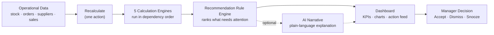
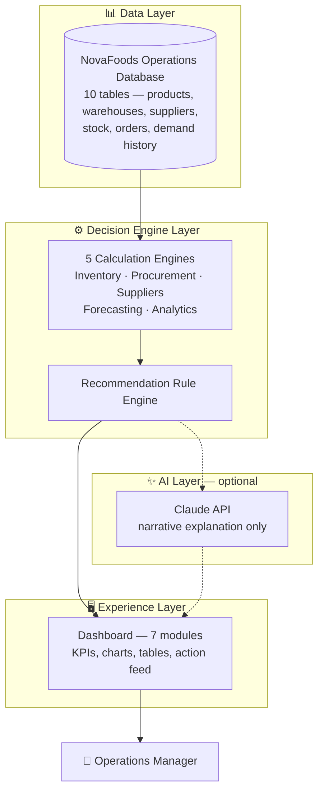
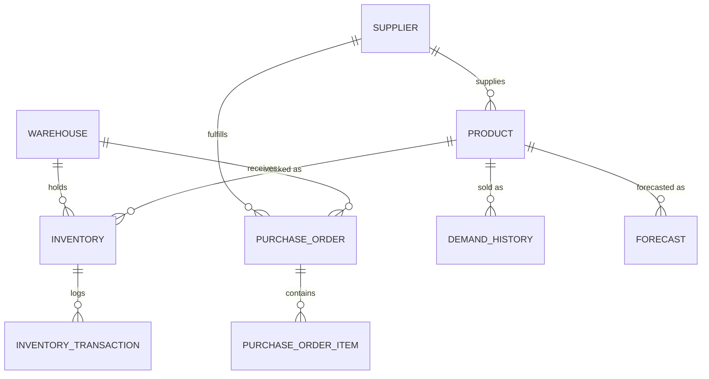

# OpsPilot AI

**An AI-Augmented Decision-Support Platform for FMCG Operations Management**

*Full-stack system design, deterministic operations-research engines, and an explainable AI layer — built end-to-end for NovaFoods Pvt. Ltd., a fictional Fast-Moving Consumer Goods company.*

---

## Executive Summary

OpsPilot AI is a decision-support platform that applies core Operations Management theory — safety stock, reorder points, EOQ, supplier reliability scoring, demand forecasting, ABC analysis — to a realistic FMCG dataset, and turns the results into a ranked, explainable action feed for an operations manager.

The system is built around one governing principle: **every number on screen is produced by deterministic, unit-tested calculation logic. AI is used only to explain what the numbers already mean — never to compute them.** This makes every recommendation auditable back to a real metric, and keeps the system fully functional even if the AI layer is unavailable.

| | |
|---|---|
| **Scope** | 1 company, 4 warehouses, 203 SKUs, 20 suppliers, 7 dashboard modules |
| **Engineering** | 5 calculation engines, 14 API routes, 10-table normalized schema |
| **Quality** | 263 automated tests across 45 test files, full TypeScript strict mode |
| **AI layer** | Claude-generated narrative only — optional, isolated, swappable |

> **Read this as:** a demonstration of translating a real business domain into a correctly modeled, tested, and explainable software system — not a UI showcase or an AI wrapper.

---

## Business Problem

FMCG operations run on thin margins and thinner patience — a stockout loses a sale immediately; excess stock quietly ties up capital and shelf space until someone notices. Three challenges show up in almost every mid-sized FMCG operation:

| Challenge | What actually happens without a system |
|---|---|
| **Inventory imbalance** | Reorder decisions are made on gut feel or a stale spreadsheet, not on demand variability or lead time — so some SKUs stock out while others sit overstocked in the same warehouse |
| **Invisible supplier risk** | A supplier's on-time delivery rate quietly degrades for months before anyone connects it to the purchase orders that are now consistently late |
| **Disconnected decision-making** | Inventory, procurement, supplier performance, and demand trends live in separate views (or separate spreadsheets), so nobody sees the *combined* picture — a manager can't easily tell if a critical stock position is also served by an unreliable supplier |

At NovaFoods' scale — 203 SKUs across 4 warehouses, sourced from 20 suppliers — reviewing this manually every day is not something a manager can meaningfully do. The result is reactive management: problems are noticed after they've already cost something.

---

## Solution

OpsPilot AI centralizes NovaFoods' operational data in one schema and runs the standard OM toolkit against it on demand, producing a single ranked list of what needs attention and why — with the underlying math always visible, and an optional AI narrative layered on top for readability.

A manager opens the Executive Dashboard, sees a headline Operations Health Score and a plain-language brief of the current situation, and works through a ranked recommendation feed — each item traceable to the exact stock position, supplier, or forecast that triggered it. One "Recalculate" action re-runs the entire pipeline against the latest data.

---

## Key Capabilities

| Module | What it's for |
|---|---|
| 🎯 **Executive Dashboard** | Company-wide health score, plain-language operational brief, top recommendations at a glance |
| 📦 **Inventory Intelligence** | Stock status, reorder points, and a health score for every product/warehouse position |
| 🛒 **Procurement Intelligence** | Live EOQ order-quantity suggestions and full purchase order tracking |
| 🏭 **Supplier Management** | Reliability scorecards — on-time delivery, lead-time consistency, price stability |
| 📈 **Demand Forecasting** | Moving-average and exponential-smoothing forecasts with accuracy tracking |
| 📊 **Operations Analytics** | ABC classification, inventory turnover, warehouse utilization across the catalog |
| 🤖 **AI Operations Copilot** | A ranked, explainable recommendation feed with optional AI narrative and an Accept/Dismiss/Snooze workflow |

---

## System Architecture

A simplified view — no framework names, just what each layer is responsible for:

- **Data Layer** — a single, normalized database holding every fact about NovaFoods' operations: what's in stock, who supplies it, what's been ordered, and what's historically sold.
- **Decision Engine Layer** — the business logic. Five independent calculation engines apply real OM formulas to the data, and a rule engine scans their output to generate ranked recommendations. This layer has no knowledge of the web framework or UI — it's pure calculation logic, which is what makes it independently testable.
- **AI Layer** — strictly additive. It reads a recommendation's structured data and produces a plain-language explanation; it is never in the path of computing a number.
- **Experience Layer** — the dashboard a manager actually uses, built from exactly what the engine layer produced.

---

## Database Design

The schema is a normalized relational model — **10 tables, 13 foreign keys, 21 indexes** — covering the full operational picture: products, warehouses, suppliers, current stock positions, purchase orders, demand history, forecasts, and recommendations.

**Why this design:**

- **`Inventory` as a resolver table.** Products and warehouses are genuinely many-to-many (any product can sit in any warehouse) — `Inventory` resolves that relationship while also holding the calculated fields (stock status, reorder point) specific to *that* product at *that* warehouse.
- **Deliberate referential-integrity choices, not defaults.** A supplier or product with purchase order history can't be deleted (`ON DELETE RESTRICT`) — order history is protected data, not a convenience default. An inventory position's transaction log is protected the same way — the one exception to an otherwise cascade-on-delete schema, chosen specifically to preserve audit trail integrity.
- **UUID primary keys**, generated client-side — lets the seed data (and any future import) construct a fully wired-up dataset in memory before a single row is written.
- **SQLite for local development**, accessed exclusively through a typed ORM — zero setup for running the project locally, with a documented one-line path to swap in PostgreSQL if the system ever needed to run as a persistent hosted service.

---

## Operations Decision Engines

Five independent engines, each a pure calculation module with no framework dependency — every formula is unit-tested against hand-computed reference values.

| Engine | In one line |
|---|---|
| **Inventory** | Safety stock, reorder points, and a 0–100 stock health score |
| **Procurement** | Economic Order Quantity — the cost-optimal reorder size |
| **Suppliers** | A weighted 0–100 reliability score per supplier |
| **Forecast** | Demand forecasting with two interchangeable methods, scored for accuracy |
| **Recommendation** | Scans every other engine's output and ranks what needs attention |

### 📦 Inventory Engine

- **Purpose** — determine how much stock to hold and when to reorder, balancing stockout risk against excess capital.
- **Inputs** — historical demand (variability and average), product lead time, current on-hand quantity.
- **Outputs** — safety stock, reorder point, a stock-status classification (Healthy / Low / Critical / Overstocked), and a continuous 0–100 health score.
- **Business impact** — replaces a fixed "reorder at X units" rule with one that adapts to each product's actual demand volatility, applied consistently across all 812 product/warehouse positions.

### 🛒 Procurement Engine

- **Purpose** — recommend an order quantity that minimizes total inventory cost (ordering cost + holding cost), the classic EOQ trade-off.
- **Inputs** — trailing annual demand, unit cost, a documented holding-cost-rate assumption.
- **Outputs** — a suggested order quantity, computed live whenever a reorder is being considered — always a suggestion the user can override, never an enforced order.
- **Business impact** — turns "how much should we order?" from a guess into a defensible, formula-backed number.

### 🏭 Supplier Engine

- **Purpose** — quantify supplier dependability instead of relying on anecdotal reputation.
- **Inputs** — delivery timeliness against contracted lead time, lead-time consistency over time, price stability across order history.
- **Outputs** — a single 0–100 reliability score per supplier, with a minimum-sample-size rule so a supplier with too little order history is marked "not yet scored" rather than given a misleadingly confident number.
- **Business impact** — makes supplier risk visible *before* it becomes a missed delivery, and gives procurement a numeric basis for renegotiation or switching.

### 📈 Forecast Engine

- **Purpose** — project near-term demand so inventory and procurement decisions aren't purely reactive to the last data point.
- **Inputs** — 18 months of historical demand per product.
- **Outputs** — forecasts from two methods (moving average and exponential smoothing), each scored for accuracy (MAPE) against actuals, so the more trustworthy method is visible per product.
- **Business impact** — surfaces genuine demand shifts (a rising or falling trend) early enough to act on, with an honest accuracy figure attached rather than a black-box prediction.

### 🎯 Recommendation Engine

- **Purpose** — the layer that turns four engines' worth of numbers into one prioritized action list.
- **Inputs** — the live outputs of the Inventory, Procurement, Supplier, and Forecast engines.
- **Outputs** — structured recommendations (category, severity, and a plain-language justification that is *always* populated with the real numbers behind it — never invented, never blank).
- **Business impact** — this is the product's core differentiator: instead of four separate dashboards a manager has to mentally cross-reference, one ranked feed tells them what to look at first, and exactly why.

---

## AI Operations Copilot

> **Design principle:** deterministic business logic decides *what* the recommendation is. AI is only ever asked to explain it in plain language. The system is fully functional — every recommendation fully justified — with the AI layer switched off entirely.

The Copilot's recommendation feed is generated end-to-end by the Recommendation Engine above, with zero AI involvement. A single, optional batch action then asks Claude to turn each recommendation's structured justification into a short, readable narrative — nothing more. If no AI provider is configured, or a request fails for any reason, the system treats that as a normal outcome: the recommendation still displays its full deterministic justification, just without the narrative gloss.

**Why this architecture, specifically:**

- **Auditability.** Every number a manager acts on traces back to a real database value through a documented formula — never to a language model's own arithmetic, which cannot be verified after the fact.
- **Reliability.** An AI provider outage, rate limit, or missing API key degrades the experience, not the correctness — nothing that matters is ever gated behind AI availability.
- **Trust.** In an operations context, a wrong recommendation has a real cost. Keeping AI strictly out of the calculation path is a deliberate, defensible boundary — not a limitation to work around later.

This mirrors how AI is increasingly expected to be deployed in regulated or high-stakes enterprise settings: as an explanation and communication layer on top of a system whose actual decisions remain deterministic and auditable.

---

## Dashboard Experience

Seven modules, each built around a specific decision a manager needs to make:

| Module | The decision it supports |
|---|---|
| 🎯 Executive Dashboard | "What does today's overall operational picture look like, and what needs my attention first?" |
| 📦 Inventory Intelligence | "Which specific SKUs, at which warehouse, need a reorder — and how urgently?" |
| 🛒 Procurement | "How much should I order, and where is every open purchase order in its lifecycle?" |
| 🏭 Suppliers | "Which suppliers are dependable, and which need a conversation?" |
| 📈 Demand Forecasting | "Is demand for this product trending up or down, and how much should I trust that trend?" |
| 📊 Analytics | "Which products matter most to the business, and how efficiently is stock moving?" |
| 🤖 Operations Copilot | "Out of everything happening right now, what's the single ranked list I should work through?" |

Every list is filterable (by warehouse, category, status, severity) and paginated; every metric that's calculated rather than raw data shows its value alongside the status it produced, so a manager never has to take a number on faith.

_📸 Screenshot placeholder — Executive Dashboard_
_📸 Screenshot placeholder — Inventory Intelligence_
_📸 Screenshot placeholder — Operations Copilot recommendation feed_

---

## Technical Highlights

| Highlight | What it demonstrates |
|---|---|
| **Layered architecture** | Business logic (`domain`), data composition (`presentation`), and API routes are strictly separated — the calculation engines have zero dependency on the web framework |
| **Pure domain logic** | Every formula is a plain, framework-free TypeScript function — testable in isolation, with no database or HTTP mock required |
| **AI provider abstraction** | The AI layer is defined by an interface, not a concrete Claude dependency — swapping providers means writing one new class, touching no callers |
| **Transaction-safe integration tests** | The recommendation sync pipeline is tested against a real database transaction boundary, not mocked — proving it behaves correctly whether run standalone or as part of the full recalculation pipeline |
| **Production-ready API design** | All 14 routes validate input, share one error-handling wrapper, and return a consistent JSON error shape — a malformed request never produces a bare, unexplained failure |
| **TypeScript strict mode** | End-to-end type safety from the database schema through to the UI, with no untyped `any` escape hatches in application code |
| **263 automated tests** | Unit tests for every formula (including hand-computed worked examples) plus integration tests for every multi-step orchestration pipeline |

---

## Engineering Decisions

**Specification before implementation.** Every formula the system uses was documented — inputs, edge cases, assumptions, and known data gaps — in a standalone specification before any calculation code was written. This meant every implementation decision (rounding rules, null-handling, what happens with insufficient data) was made deliberately, once, rather than improvised differently in five different places.

**Deterministic-first, AI-secondary.** Covered in detail above — the single most consequential architectural decision in the project, chosen for auditability over novelty.

**Consolidated, page-oriented API routes.** Rather than exposing one endpoint per calculation engine, routes are organized around what each dashboard page actually needs — fewer network round-trips, and each page's Server Component calls the same underlying data module directly (no HTTP call at all for the initial page load; the API route exists for client-side refetches and write actions).

**One explicit recalculation pipeline, not five independent triggers.** The five engines have real dependencies on each other's output (recommendations need every other engine's latest numbers). A single "Recalculate" action runs them in the correct dependency order, so there's exactly one mental model for "when do the numbers update," not five.

**Read persisted data where it's stable, compute live where it's cheap and needs freshness.** Stock status and reorder points are persisted (expensive to compute, don't need per-request freshness). A stock health score and EOQ suggestion are computed on every read (cheap, and always reflect the exact current on-hand quantity) rather than risking a stale cached value.

---

## Challenges Solved

A few of the more interesting problems that came up during development — the kind that only surface once you actually run the system against real data, not just its test suite:

- **A hydration bug that only appeared in the browser.** Server-side and client-side date formatting produced different strings for the identical date, because the two JavaScript environments' locale libraries disagreed — invisible to any automated test, only visible when actually loading the page. Fixed by hand-writing a locale-independent formatter.
- **A silently wrong number, hiding from 263 passing tests.** A recommendation's justification text was interpolating an unrounded, many-decimal-place figure into a user-facing sentence. Every existing test checked for the presence of a substring, so none of them caught it — only a visual review of the real rendered page did. Fixed at the source, not papered over in the UI.
- **A pagination bug that only showed up at realistic data volume.** An early version of the Inventory list rendered all 812 rows at once. Caught by actually loading the page against the seeded dataset rather than a handful of test fixtures, and fixed with proper pagination.
- **A self-directed audit that found a real, reproducible failure mode.** Before considering the project complete, a full technical audit of the API layer found that an invalid filter value sent to any list endpoint produced a blank, unexplained server error — reproduced with a single request, then fixed by adding shared input validation and consistent error handling across every route.
- **A subtle conflict between custom error handling and the framework's own internal signals.** The fix above initially swallowed a special internal error the framework uses to decide whether a page can be pre-built at deploy time — caught by running a full production build (not just the dev server) and inspecting its output carefully.

---

## Testing & Quality Assurance

| | |
|---|---|
| **Automated tests** | 263, across 45 test files |
| **Unit tests** | Every calculation engine formula, verified against hand-computed worked examples |
| **Integration tests** | Every multi-step pipeline (recalculation orchestrators, the recommendation sync transaction, AI narrative generation) |
| **Static checks** | TypeScript strict mode, ESLint, clean on every commit |
| **Manual verification** | Every dashboard page checked in a real browser against real seeded data — console errors, network responses, and rendered output, not just "the build succeeded" |
| **Pre-commit audit** | A structured, self-directed review across architecture, API consistency, type safety, and test coverage before the codebase was considered done |

The guiding philosophy: a green test suite proves the *formulas* are correct, not that the *product* works. Several of the real bugs described above would have shipped with 100% of the automated suite passing — they were only caught by actually using the running application the way a real user would.

---

## Future Roadmap

Explicitly not built — documented here as known, deliberate scope boundaries rather than implied gaps:

- **Authentication and multi-tenancy** — the system currently serves one company's data with no login; a real multi-customer deployment would need both.
- **Database-level pagination at scale** — the current approach computes KPIs over a full filtered result set, which is appropriate at hundreds of rows per warehouse but would need to move to database-level aggregation at a much larger scale.
- **A fourth supplier-reliability component (order accuracy)** — the scoring formula currently uses three of four planned components; the fourth needs a data field (received quantity vs. ordered quantity) the schema doesn't yet capture.
- **Historical trend charts for headline metrics** — today's metrics are point-in-time; showing a genuine 90-day trend would need a lightweight metric-snapshot table that doesn't exist yet.
- **Per-warehouse demand history** — demand is currently tracked at the product level company-wide; a true per-warehouse safety stock calculation would need demand data broken out by warehouse.
- **Hosted deployment and CI/CD** — the project currently runs locally by design; going live would mean adding a deployment pipeline and picking a persistent hosted database.

---

## Key Takeaways

This project demonstrates the ability to take an ambiguous, real-world business problem and turn it into a correctly modeled, tested, and explainable software system — not just a working UI.

- **Business understanding** — every engine implements an actual, named Operations Management technique (safety stock, EOQ, ABC analysis, weighted reliability scoring), applied to a business problem that was reasoned through before any code was written.
- **Systems thinking** — a five-engine dependency chain, a normalized data model with deliberate referential-integrity choices, and a clear boundary between deterministic logic and AI — designed as a coherent system, not assembled feature by feature.
- **Engineering discipline** — specification before implementation, 263 tests including hand-verified worked examples, and a self-directed audit before calling the work done.
- **Judgment about AI** — a considered, explicit decision to keep AI out of the calculation path entirely, for reasons (auditability, reliability, trust) that matter more in a real operations context than novelty does.

