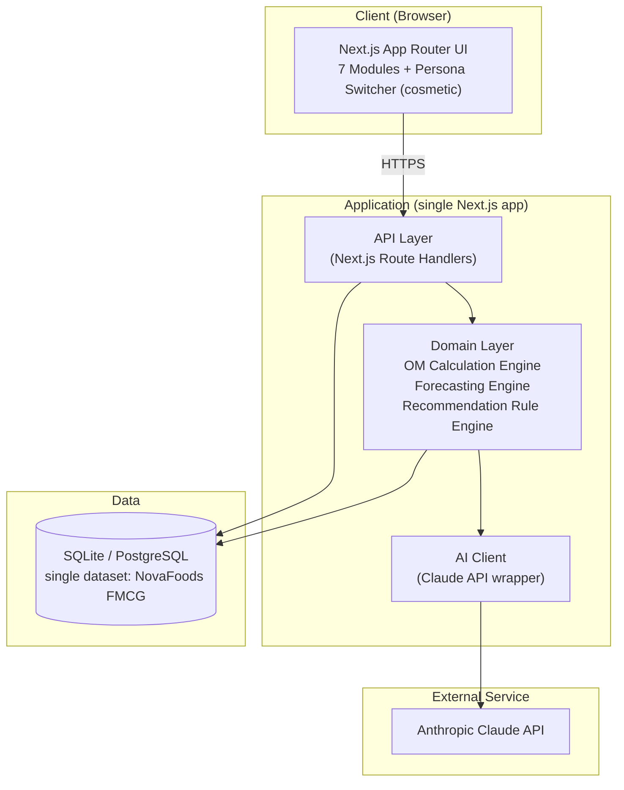
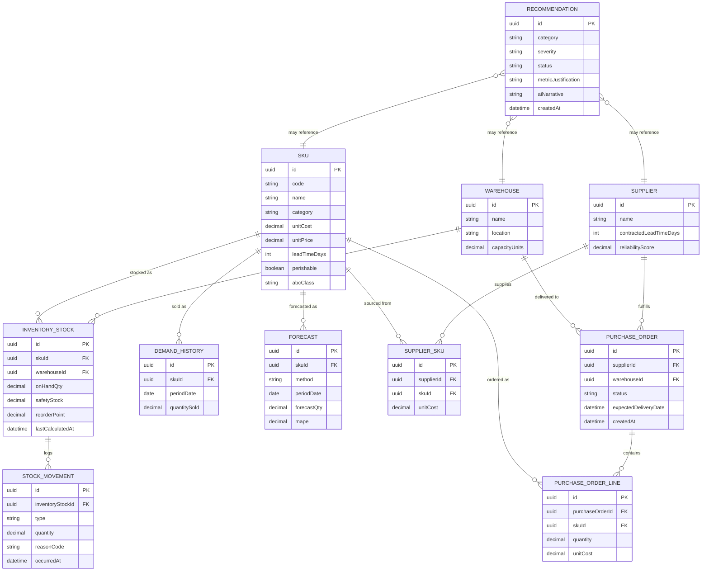
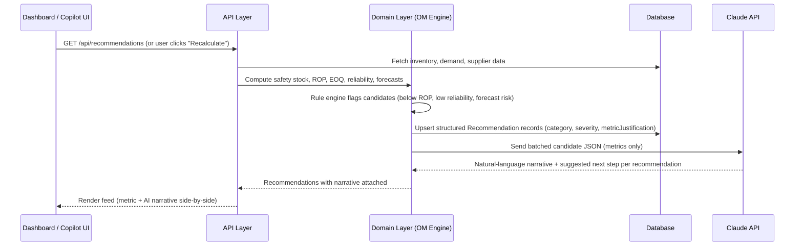
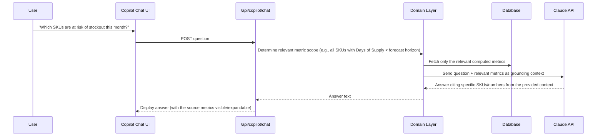

# OpsPilot AI — System Architecture

**Status:** Reflects the implemented application (v2 — simplified academic scope)
**Last updated:** 2026-08-03
**Related:** [PROJECT_PLAN.md](./PROJECT_PLAN.md) · [PRODUCT_REQUIREMENTS_DOCUMENT.md](./PRODUCT_REQUIREMENTS_DOCUMENT.md) · [DEVELOPMENT_ROADMAP.md](./DEVELOPMENT_ROADMAP.md)

---

## 1. Architecture Principles

1. **Numbers come from code, narrative comes from AI.** All OM metrics (safety stock, ROP, EOQ, reliability scores, forecasts) are computed by a deterministic, unit-tested calculation engine. Claude only explains, ranks, and narrates outputs of that engine — it never computes a number itself.
2. **Single company, no tenancy layer.** There is exactly one dataset (NovaFoods FMCG). No `organizationId` scoping, no isolation layer — this simplification is deliberate and documented, not an oversight.
3. **Layered, not tangled.** Presentation, API, business logic, and data access stay separate so the OM calculation engine can be unit-tested independently of the web framework — this is the one piece of "production-grade" discipline worth keeping, because it's what makes the project gradeable/demoable/debuggable.
4. **Boring, explainable technology.** Favor well-understood, explainable methods (moving average, exponential smoothing, weighted scoring) over opaque ML, consistent with the "decision support you can trust" narrative.
5. **No infrastructure without a demo reason.** No caching layer, job scheduler, or CI/CD pipeline unless a specific feature genuinely requires it. Every piece of infrastructure below exists because a module needs it, not because "production apps have it."

---

## 2. Technology Stack

| Layer | Choice | Rationale |
|---|---|---|
| Frontend framework | **Next.js 14+ (App Router, TypeScript)** | Full-stack React framework; one deployable unit for a solo student project |
| UI components | **Tailwind CSS + shadcn/ui** | Fast, consistent, accessible components; gives the "modern SaaS" look with minimal custom CSS |
| Charts | **Recharts** | Simple, composable charting for stock trends, forecast curves, KPI sparklines |
| Backend | **Next.js Route Handlers** | Co-located API and frontend; no second service to deploy or operate |
| Business logic | **Standalone TypeScript domain module (`/lib/domain`)** | Framework-agnostic OM calculation & recommendation engine, independently unit-testable — the one non-negotiable architectural boundary |
| ORM | **Prisma** | Type-safe schema, migrations, query layer |
| Database | **SQLite** (default, via Prisma) — **or PostgreSQL (Neon free tier)** if a persistently hosted live demo is needed | SQLite needs zero external setup and is ideal for a single-dataset academic project; Prisma makes swapping to Postgres a config change, not a rewrite, if the demo needs to live on the web long-term |
| AI provider | **Claude API (Anthropic)** | Generates natural-language recommendation narratives and answers Copilot chat questions, grounded in structured metric payloads |
| Testing | **Vitest** (domain logic unit tests) | Domain math must be verifiably correct against hand-computed reference values |
| Hosting | **Vercel** (or simply run locally for submission/demo) | Effectively zero-ops if a live link is wanted; entirely optional |

### Explicitly removed from the stack (see PROJECT_PLAN §7)
Redis/caching, background job scheduler, CI/CD pipeline, multi-environment deployment (preview/staging/prod), Sentry/observability tooling, rate limiting, Postgres Row-Level Security, full auth provider (NextAuth org/session/RBAC system).

---

## 3. High-Level Architecture



### Layer Responsibilities

- **UI Layer**: The 7 modules (Executive Dashboard, Inventory Intelligence, Procurement, Suppliers, Demand Forecasting, Analytics, Operations Copilot) as routes under the App Router, plus a cosmetic persona switcher that adjusts emphasis/ordering only.
- **API Layer**: Thin route handlers — validate input (Zod), call the domain layer, return JSON. No business logic here.
- **Domain Layer** (`/lib/domain`): Pure, framework-agnostic TypeScript:
  - `inventory/` — safety stock, ROP, days of supply, ABC classification
  - `procurement/` — EOQ calculation, replenishment suggestion generation
  - `suppliers/` — reliability scoring
  - `forecasting/` — moving average, exponential smoothing, MAPE/MAE backtesting
  - `recommendations/` — rule engine that scans computed metrics and produces ranked candidate recommendations
- **AI Client**: Takes a structured JSON payload (recommendation candidates, or the relevant metric slice for a Copilot chat question) and calls Claude to produce human-readable narrative or answer text. AI output is *display text only*, stored/returned alongside — never instead of — the structured data.

**On recalculation (no background jobs):** metrics are recalculated **on demand** — either computed at request time (cheap enough at this data scale: ~200 SKUs) or triggered explicitly via a "Recalculate" action in the UI that reruns the domain layer and updates stored derived values. There is no cron/scheduler; this is a deliberate simplification (see PROJECT_PLAN §7) appropriate because the dataset doesn't change in real time outside of demo interactions.

---

## 4. Single-Company Data Model

There is no `Organization` entity and no tenant-scoping. The schema represents one company's operations directly. A `User` table exists only to back the cosmetic persona switcher (which persona's "lens" is currently selected) — it is not an authentication/authorization boundary, and no route checks a user's identity before returning data.

If a real login screen is included for visual polish (optional, see Roadmap Phase 7), it may gate the whole app behind a single shared demo password, but it does not create per-user data partitioning — there is only one dataset to see.

---

## 5. Data Model (Entity-Relationship Overview)



This is intentionally the same core operational model as v1, minus `Organization`, `User`/`Role` as access-control entities, `Subscription`, and `AuditLog`.

---

## 6. AI Pipeline (Recommendations + Copilot Chat)

### 6.1 Recommendation Feed



### 6.2 Grounded Copilot Chat



**Failure mode handling**: if the Claude API call fails or times out, the structured recommendation (category, severity, `metricJustification`) is still shown, and the Copilot chat surfaces a clear "AI narrative unavailable" state rather than blocking — correctness of the underlying numbers never depends on Claude being reachable.

---

## 7. API Design (Actual Endpoints)

All endpoints are prefixed `/api`. No auth/session check is required to read or write demo data (single-dataset app, see §8). Routes are consolidated per dashboard page rather than one endpoint per engine — a page's Server Component calls the matching `lib/presentation/*.ts` module directly (no HTTP round-trip); the route below is a thin wrapper over the same module, used for client-side refetches (filters, pagination) and write actions. Query parameters and request bodies are validated by hand (`lib/api/http.ts`: enum allow-lists, positive-integer checks) rather than a schema library; invalid input returns `400` with a `{ error: string }` body, and every route shares the same try/catch wrapper so an unexpected failure returns `500` with that same envelope instead of an unhandled error.

| Method | Endpoint | Purpose |
|---|---|---|
| GET | `/api/dashboard` | Executive Dashboard: KPIs, Executive Brief, warehouse utilization, top recommendations |
| GET | `/api/inventory?warehouseId=&category=&stockStatus=&page=&pageSize=` | Paginated Inventory Intelligence list + KPIs + category breakdown |
| GET | `/api/inventory/:productId` | Inventory detail for one product: per-warehouse position, demand history, demand statistics |
| GET | `/api/procurement?status=&supplierId=&warehouseId=&page=&pageSize=` | EOQ recommendations + paginated purchase order list |
| GET | `/api/suppliers` | Supplier list with reliability scores |
| GET | `/api/suppliers/:supplierId` | Supplier scorecard detail |
| GET | `/api/forecasting?productId=` | Forecast series + accuracy for one product |
| GET | `/api/analytics` | Company-wide analytics: ABC classification, turnover, warehouse utilization |
| GET | `/api/copilot?status=&severity=&category=` | Recommendation feed (defaults to `status=ACTIVE`) |
| PATCH | `/api/copilot/recommendations/:id` | Update a recommendation's status (Accept/Dismiss/Snooze) |
| POST | `/api/copilot/narrate` | Batch-generate AI narratives for eligible ACTIVE recommendations |
| GET | `/api/products` | Product catalog (id, sku, name, category, abcClass) for pickers/filters |
| GET | `/api/warehouses` | Warehouse list for pickers/filters |
| POST | `/api/recalculate` | Runs every engine's orchestrator in dependency order: Inventory → Suppliers → Forecast → Analytics (ABC) → Recommendations |

---

## 8. Auth & Access (Simplified)

- No account system, no sessions tied to authorization, no server-side permission checks.
- Optional cosmetic login screen (single shared demo password via an env var) purely for the "modern SaaS" first impression — does not gate any data differently per user.
- Persona switcher is client-side UI state only; it changes what's emphasized on screen, not what's queryable.

## 9. Security (Right-Sized for a Public Academic Demo)

- TLS by default via hosting platform (if deployed).
- Input validation (Zod) on every API route that accepts a body, to prevent malformed data from corrupting the demo dataset.
- Claude API key stored as a server-side environment variable, never exposed to the client.
- No secrets, PII, or real credentials exist in the system — synthetic data only — so the production-grade controls in v1 (RLS, rate limiting, audit logging, secrets rotation) are not proportionate and are intentionally omitted.

## 10. Running & Deploying

- **Local development**: `npm run dev` against a local SQLite file (`prisma/dev.db`), seeded via `npm run seed`.
- **Optional live demo**: deploy the same Next.js app to Vercel; swap the Prisma datasource to a free-tier Neon Postgres instance if persistent hosted storage is wanted (SQLite files don't persist reliably on serverless hosts). This is a one-line `datasource` change in `schema.prisma`, not an architecture change.
- No CI pipeline, no staging environment, no preview deploys — a single `npm run build && npm run start` (or `vercel deploy`) is sufficient for an academic submission.

## 11. Repository Structure (Actual)

```
opspilot-ai/
├── app/                               # Next.js App Router pages & layouts
│   ├── page.tsx                       # "/" — Executive Dashboard
│   ├── loading.tsx / error.tsx / not-found.tsx
│   ├── inventory/
│   │   ├── page.tsx                   # Inventory Intelligence list
│   │   └── [productId]/page.tsx       # Inventory detail
│   ├── procurement/page.tsx           # Procurement (EOQ + purchase orders)
│   ├── suppliers/
│   │   ├── page.tsx                   # Suppliers list
│   │   └── [supplierId]/page.tsx      # Supplier scorecard
│   ├── forecasting/page.tsx           # Demand Forecasting
│   ├── analytics/page.tsx             # Analytics
│   ├── copilot/page.tsx               # Operations Copilot (recommendations)
│   └── api/                           # Route handlers — thin wrappers over lib/presentation
│       ├── dashboard/, inventory/, procurement/, suppliers/,
│       ├── forecasting/, analytics/, copilot/, products/,
│       └── warehouses/, recalculate/
├── lib/
│   ├── domain/                        # Framework-agnostic business logic (pure, Prisma-free)
│   │   ├── inventory/
│   │   ├── procurement/
│   │   ├── suppliers/
│   │   ├── forecasting/
│   │   ├── analytics/
│   │   └── recommendations/
│   ├── presentation/                  # Page/route data composition (dashboardData.ts, inventoryData.ts, ...)
│   ├── api/                           # Shared error handling + query-param validation (lib/api/http.ts)
│   ├── ai/                            # Claude API client + prompt templates (batch narration only)
│   ├── db/                            # Prisma client singleton
│   └── format.ts                      # Locale-independent currency/number/date formatting
├── prisma/
│   ├── schema.prisma
│   └── seed.ts                        # NovaFoods synthetic dataset generator
├── components/                        # ui/, nav/, and per-module charts/tables/filters
└── tests/
    ├── unit/                          # Domain logic tests (Vitest) — reference-value checks
    └── integration/                   # Orchestrator/pipeline integration tests (Vitest)
```

## 12. Key Architectural Decisions (ADR Summary)

| Decision | Alternative Considered | Why This Choice |
|---|---|---|
| Single Next.js app, no tenancy | Multi-tenant SaaS architecture (v1) | Only one dataset exists; tenancy adds complexity with zero demo value |
| SQLite by default, Postgres optional | Always-on Postgres | Zero external setup for local dev/grading; one-line swap if a hosted link is needed |
| On-demand recalculation | Cron/background job scheduler | Dataset is static between demo interactions; a scheduler adds infra with no visible benefit |
| No server-enforced RBAC | Full auth + permission matrix (v1) | No sensitive multi-tenant boundary to protect; persona switcher achieves the UX storytelling goal without the engineering cost |
| TypeScript domain layer for OM math | Python/pandas microservice | Avoids a second runtime; moving average & exponential smoothing don't need Python's numerical stack |
| Claude API for narrative/chat only, never calculation | LLM computes metrics directly | Preserves correctness/auditability — the central point of an OM-concepts demonstration |

## 13. If This Were Productized Later (Not In Scope Now)

For reference only — not part of this project's deliverable: multi-tenancy, real authentication/RBAC, subscription billing, audit logging, background job processing, caching, and CI/CD would all need to be reintroduced, largely following the v1 architecture this document supersedes. Noted here so the simplification is understood as scope-fit, not a technical limitation.
